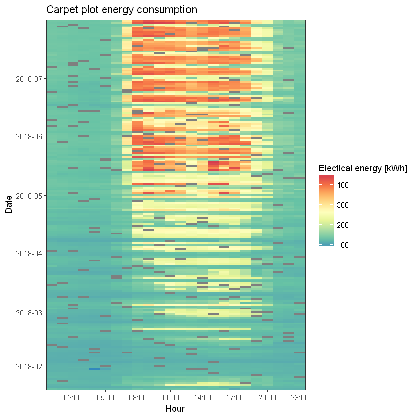
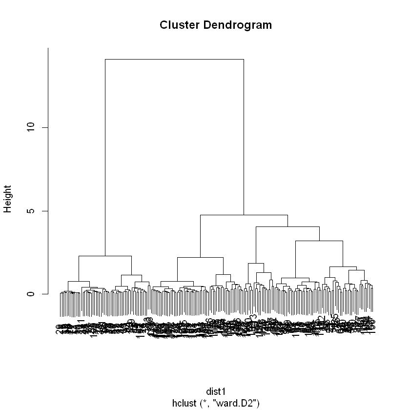
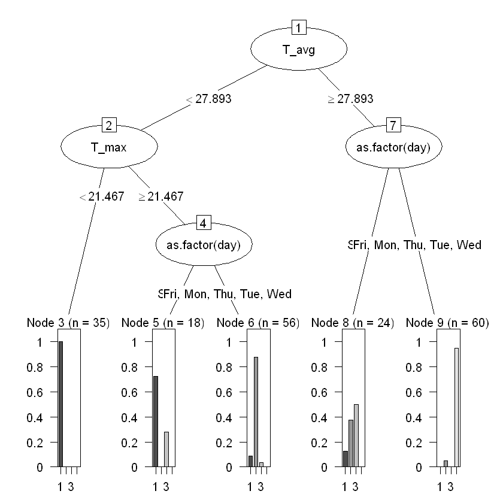

```R
library(purrr)
library(lubridate)
library(plyr)
library(dplyr)
library(knitr)
library(magrittr)
library(tidyr)
library(ggplot2)
library(RColorBrewer)
library(scales)
library(dendextend)
library(rpart)
library(partykit)
library(ggsci)
library(zoo)
library(imputeTS)
library(MLmetrics)
```


```R
pydata = readRDS(file = "C:/Users/PC/Desktop/PhD Marco/pydata/pydata.rds")
```


```R
pydata
```


<table>
<thead><tr><th scope=col>date_time</th><th scope=col>energy_h</th><th scope=col>date</th><th scope=col>time</th></tr></thead>
<tbody>
	<tr><td>2018-01-20 00:00:00</td><td>127.7760           </td><td>2018-01-20         </td><td>00:00:00           </td></tr>
	<tr><td>2018-01-20 01:00:00</td><td>124.9081           </td><td>2018-01-20         </td><td>01:00:00           </td></tr>
	<tr><td>2018-01-20 02:00:00</td><td>122.7869           </td><td>2018-01-20         </td><td>02:00:00           </td></tr>
	<tr><td>2018-01-20 03:00:00</td><td>121.9495           </td><td>2018-01-20         </td><td>03:00:00           </td></tr>
	<tr><td>2018-01-20 04:00:00</td><td>120.5760           </td><td>2018-01-20         </td><td>04:00:00           </td></tr>
	<tr><td>2018-01-20 05:00:00</td><td>121.0421           </td><td>2018-01-20         </td><td>05:00:00           </td></tr>
	<tr><td>2018-01-20 06:00:00</td><td>121.2157           </td><td>2018-01-20         </td><td>06:00:00           </td></tr>
	<tr><td>2018-01-20 07:00:00</td><td>121.5915           </td><td>2018-01-20         </td><td>07:00:00           </td></tr>
	<tr><td>2018-01-20 08:00:00</td><td>131.1631           </td><td>2018-01-20         </td><td>08:00:00           </td></tr>
	<tr><td>2018-01-20 09:00:00</td><td>126.7979           </td><td>2018-01-20         </td><td>09:00:00           </td></tr>
	<tr><td>2018-01-20 10:00:00</td><td>127.6975           </td><td>2018-01-20         </td><td>10:00:00           </td></tr>
	<tr><td>2018-01-20 11:00:00</td><td>128.9385           </td><td>2018-01-20         </td><td>11:00:00           </td></tr>
	<tr><td>2018-01-20 12:00:00</td><td>130.6931           </td><td>2018-01-20         </td><td>12:00:00           </td></tr>
	<tr><td>2018-01-20 13:00:00</td><td>129.4472           </td><td>2018-01-20         </td><td>13:00:00           </td></tr>
	<tr><td>2018-01-20 14:00:00</td><td>126.0499           </td><td>2018-01-20         </td><td>14:00:00           </td></tr>
	<tr><td>2018-01-20 15:00:00</td><td>125.2312           </td><td>2018-01-20         </td><td>15:00:00           </td></tr>
	<tr><td>2018-01-20 16:00:00</td><td>128.0706           </td><td>2018-01-20         </td><td>16:00:00           </td></tr>
	<tr><td>2018-01-20 17:00:00</td><td>108.1118           </td><td>2018-01-20         </td><td>17:00:00           </td></tr>
	<tr><td>2018-01-20 18:00:00</td><td>120.5773           </td><td>2018-01-20         </td><td>18:00:00           </td></tr>
	<tr><td>2018-01-20 19:00:00</td><td>118.2734           </td><td>2018-01-20         </td><td>19:00:00           </td></tr>
	<tr><td>2018-01-20 20:00:00</td><td>116.1321           </td><td>2018-01-20         </td><td>20:00:00           </td></tr>
	<tr><td>2018-01-20 21:00:00</td><td>116.4543           </td><td>2018-01-20         </td><td>21:00:00           </td></tr>
	<tr><td>2018-01-20 22:00:00</td><td>115.6634           </td><td>2018-01-20         </td><td>22:00:00           </td></tr>
	<tr><td>2018-01-20 23:00:00</td><td>114.8919           </td><td>2018-01-20         </td><td>23:00:00           </td></tr>
	<tr><td>2018-01-21 00:00:00</td><td>114.5924           </td><td>2018-01-21         </td><td>00:00:00           </td></tr>
	<tr><td>2018-01-21 01:00:00</td><td>114.1863           </td><td>2018-01-21         </td><td>01:00:00           </td></tr>
	<tr><td>2018-01-21 02:00:00</td><td>114.2859           </td><td>2018-01-21         </td><td>02:00:00           </td></tr>
	<tr><td>2018-01-21 03:00:00</td><td>113.8605           </td><td>2018-01-21         </td><td>03:00:00           </td></tr>
	<tr><td>2018-01-21 04:00:00</td><td>113.4396           </td><td>2018-01-21         </td><td>04:00:00           </td></tr>
	<tr><td>2018-01-21 05:00:00</td><td>113.2992           </td><td>2018-01-21         </td><td>05:00:00           </td></tr>
	<tr><td>...</td><td>...</td><td>...</td><td>...</td></tr>
	<tr><td>2018-07-30 18:00:00</td><td>385.2715           </td><td>2018-07-30         </td><td>18:00:00           </td></tr>
	<tr><td>2018-07-30 19:00:00</td><td>299.1503           </td><td>2018-07-30         </td><td>19:00:00           </td></tr>
	<tr><td>2018-07-30 20:00:00</td><td>242.1310           </td><td>2018-07-30         </td><td>20:00:00           </td></tr>
	<tr><td>2018-07-30 21:00:00</td><td>162.3391           </td><td>2018-07-30         </td><td>21:00:00           </td></tr>
	<tr><td>2018-07-30 22:00:00</td><td>141.8393           </td><td>2018-07-30         </td><td>22:00:00           </td></tr>
	<tr><td>2018-07-30 23:00:00</td><td>147.7278           </td><td>2018-07-30         </td><td>23:00:00           </td></tr>
	<tr><td>2018-07-31 00:00:00</td><td>135.1169           </td><td>2018-07-31         </td><td>00:00:00           </td></tr>
	<tr><td>2018-07-31 01:00:00</td><td>134.5644           </td><td>2018-07-31         </td><td>01:00:00           </td></tr>
	<tr><td>2018-07-31 02:00:00</td><td>132.8047           </td><td>2018-07-31         </td><td>02:00:00           </td></tr>
	<tr><td>2018-07-31 03:00:00</td><td>130.5584           </td><td>2018-07-31         </td><td>03:00:00           </td></tr>
	<tr><td>2018-07-31 04:00:00</td><td>130.7711           </td><td>2018-07-31         </td><td>04:00:00           </td></tr>
	<tr><td>2018-07-31 05:00:00</td><td>134.1494           </td><td>2018-07-31         </td><td>05:00:00           </td></tr>
	<tr><td>2018-07-31 06:00:00</td><td>140.2975           </td><td>2018-07-31         </td><td>06:00:00           </td></tr>
	<tr><td>2018-07-31 07:00:00</td><td>295.2008           </td><td>2018-07-31         </td><td>07:00:00           </td></tr>
	<tr><td>2018-07-31 08:00:00</td><td>400.3487           </td><td>2018-07-31         </td><td>08:00:00           </td></tr>
	<tr><td>2018-07-31 09:00:00</td><td>426.9638           </td><td>2018-07-31         </td><td>09:00:00           </td></tr>
	<tr><td>2018-07-31 10:00:00</td><td>412.4851           </td><td>2018-07-31         </td><td>10:00:00           </td></tr>
	<tr><td>2018-07-31 11:00:00</td><td>406.5116           </td><td>2018-07-31         </td><td>11:00:00           </td></tr>
	<tr><td>2018-07-31 12:00:00</td><td>386.4054           </td><td>2018-07-31         </td><td>12:00:00           </td></tr>
	<tr><td>2018-07-31 13:00:00</td><td>370.9583           </td><td>2018-07-31         </td><td>13:00:00           </td></tr>
	<tr><td>2018-07-31 14:00:00</td><td>388.5688           </td><td>2018-07-31         </td><td>14:00:00           </td></tr>
	<tr><td>2018-07-31 15:00:00</td><td>409.9565           </td><td>2018-07-31         </td><td>15:00:00           </td></tr>
	<tr><td>2018-07-31 16:00:00</td><td>404.2290           </td><td>2018-07-31         </td><td>16:00:00           </td></tr>
	<tr><td>2018-07-31 17:00:00</td><td>386.7547           </td><td>2018-07-31         </td><td>17:00:00           </td></tr>
	<tr><td>2018-07-31 18:00:00</td><td>358.4386           </td><td>2018-07-31         </td><td>18:00:00           </td></tr>
	<tr><td>2018-07-31 19:00:00</td><td>287.3840           </td><td>2018-07-31         </td><td>19:00:00           </td></tr>
	<tr><td>2018-07-31 20:00:00</td><td>241.6266           </td><td>2018-07-31         </td><td>20:00:00           </td></tr>
	<tr><td>2018-07-31 21:00:00</td><td>163.0917           </td><td>2018-07-31         </td><td>21:00:00           </td></tr>
	<tr><td>2018-07-31 22:00:00</td><td>142.1800           </td><td>2018-07-31         </td><td>22:00:00           </td></tr>
	<tr><td>2018-07-31 23:00:00</td><td>153.1673           </td><td>2018-07-31         </td><td>23:00:00           </td></tr>
</tbody>
</table>


```R
p <- sample(pydata$date_time, size = 200)

pydata <- pydata %>%
  mutate(
    energy_h = ifelse(date_time %in% p, NA, energy_h)
  ) #### Mutate adds new variables and preserves existing; transmute drops existing variables ####
```


```R
sum(is.na(pydata$energy_h))
```


200


```R
#### visualization carpet plot ####

cols <- brewer.pal(9, "Spectral")

carpet <- ggplot(data= pydata , aes(x = as.POSIXct(time, format="%H:%M:%S" , tz="Etc/GMT-8") , y = date ))+
  geom_tile(data= pydata , aes_string(fill = "energy_h" ))+
  scale_fill_gradientn(colours = rev(cols))+
  theme_bw()+
  scale_y_date(expand = c(0,0),labels = date_format("%Y-%m" , tz="Etc/GMT-8"), breaks = date_breaks("1 month"))+
  scale_x_datetime(expand = c(0,0), labels = date_format(("%H:%M") , tz="Etc/GMT-8"), breaks = date_breaks("3 hour"))+
  labs( x = "Hour" , y="Date", fill="Electical energy [kWh]")+
  ggtitle("Carpet plot energy consumption")

```


```R
plot(carpet)
```





```R
####replace missing values with data interpolation####

pydata$energy_h <- (na.interpolation(pydata$energy_h, option = "linear"))
```


```R
#### construction of the matrix M by N ####

py.mxn <- spread(pydata[,2:4], "time", "energy_h") #### Spread A Key-Value Pair Across Multiple Columns ####
```


```R

max <- apply(py.mxn[,2:25], 1, max) #### Returns a vector or array or list of values obtained by applying a function to margins of an array or matrix ####

py.mxn[,2:25] <- py.mxn[,2:25]/max
```


```R
py.mxn
```


<table>
<thead><tr><th scope=col>date</th><th scope=col>00:00:00</th><th scope=col>01:00:00</th><th scope=col>02:00:00</th><th scope=col>03:00:00</th><th scope=col>04:00:00</th><th scope=col>05:00:00</th><th scope=col>06:00:00</th><th scope=col>07:00:00</th><th scope=col>08:00:00</th><th scope=col>...</th><th scope=col>14:00:00</th><th scope=col>15:00:00</th><th scope=col>16:00:00</th><th scope=col>17:00:00</th><th scope=col>18:00:00</th><th scope=col>19:00:00</th><th scope=col>20:00:00</th><th scope=col>21:00:00</th><th scope=col>22:00:00</th><th scope=col>23:00:00</th></tr></thead>
<tbody>
	<tr><td>2018-01-20</td><td>0.9741765 </td><td>0.9523112 </td><td>0.9361388 </td><td>0.9297543 </td><td>0.9192826 </td><td>0.9228365 </td><td>0.9241598 </td><td>0.9270250 </td><td>1.0000000 </td><td>...       </td><td>0.9610164 </td><td>0.9547746 </td><td>0.9764228 </td><td>0.8242549 </td><td>0.9192928 </td><td>0.9017278 </td><td>0.8854024 </td><td>0.8878588 </td><td>0.8818289 </td><td>0.8759470 </td></tr>
	<tr><td>2018-01-21</td><td>0.8896819 </td><td>0.8865291 </td><td>0.8873022 </td><td>0.8839993 </td><td>0.8807317 </td><td>0.8796418 </td><td>0.8843452 </td><td>0.8898204 </td><td>0.9189354 </td><td>...       </td><td>0.9607321 </td><td>1.0000000 </td><td>0.9311023 </td><td>0.9576004 </td><td>0.9888033 </td><td>0.9342934 </td><td>0.9417608 </td><td>0.9303756 </td><td>0.9239585 </td><td>0.9210006 </td></tr>
	<tr><td>2018-01-22</td><td>0.4764467 </td><td>0.4786885 </td><td>0.4765896 </td><td>0.4757276 </td><td>0.4756990 </td><td>0.4764317 </td><td>0.5190519 </td><td>0.5294276 </td><td>0.5799018 </td><td>...       </td><td>0.9217736 </td><td>0.9192220 </td><td>0.8816173 </td><td>0.8642381 </td><td>0.7784326 </td><td>0.5295019 </td><td>0.5717251 </td><td>0.5038622 </td><td>0.4949486 </td><td>0.5060699 </td></tr>
	<tr><td>2018-01-23</td><td>0.5430183 </td><td>0.5371770 </td><td>0.5265180 </td><td>0.5238624 </td><td>0.5232075 </td><td>0.5255008 </td><td>0.5383392 </td><td>0.5995037 </td><td>0.6060342 </td><td>...       </td><td>0.9536034 </td><td>1.0000000 </td><td>0.9034598 </td><td>0.8244210 </td><td>0.7136585 </td><td>0.6028960 </td><td>0.5985227 </td><td>0.5459409 </td><td>0.5488802 </td><td>0.5349581 </td></tr>
	<tr><td>2018-01-24</td><td>0.8017604 </td><td>0.7963491 </td><td>0.7909378 </td><td>0.7816676 </td><td>0.7743902 </td><td>0.7755150 </td><td>0.7914149 </td><td>0.8746215 </td><td>0.8645298 </td><td>...       </td><td>0.9319135 </td><td>0.9678723 </td><td>1.0000000 </td><td>0.9595849 </td><td>0.8824892 </td><td>0.8628876 </td><td>0.9019818 </td><td>0.7969224 </td><td>0.7768281 </td><td>0.7719372 </td></tr>
	<tr><td>2018-01-25</td><td>0.7622942 </td><td>0.7697194 </td><td>0.7699630 </td><td>0.7666444 </td><td>0.7643332 </td><td>0.7667172 </td><td>0.7785903 </td><td>0.8485467 </td><td>0.8217743 </td><td>...       </td><td>0.8881540 </td><td>0.9212549 </td><td>0.9646563 </td><td>1.0000000 </td><td>0.9133771 </td><td>0.8533455 </td><td>0.8918410 </td><td>0.8166248 </td><td>0.8091040 </td><td>0.8041026 </td></tr>
	<tr><td>2018-01-26</td><td>0.8568647 </td><td>0.8511661 </td><td>0.8394957 </td><td>0.8309127 </td><td>0.8304257 </td><td>0.8301824 </td><td>0.8552694 </td><td>0.9180813 </td><td>0.9140989 </td><td>...       </td><td>0.9761434 </td><td>1.0000000 </td><td>0.9910830 </td><td>0.9743882 </td><td>0.9685514 </td><td>0.9560183 </td><td>0.9556421 </td><td>0.8532105 </td><td>0.8590335 </td><td>0.8515582 </td></tr>
	<tr><td>2018-01-27</td><td>0.9702334 </td><td>0.9710251 </td><td>0.9637576 </td><td>0.9631217 </td><td>0.9604604 </td><td>0.9565312 </td><td>0.9505664 </td><td>0.9545185 </td><td>0.9930056 </td><td>...       </td><td>0.9785080 </td><td>0.9739574 </td><td>0.9728438 </td><td>0.9716194 </td><td>0.9756120 </td><td>0.9704037 </td><td>0.9651955 </td><td>0.9660181 </td><td>0.9740823 </td><td>0.9725025 </td></tr>
	<tr><td>2018-01-28</td><td>0.9587553 </td><td>0.9588637 </td><td>0.9534902 </td><td>0.9533567 </td><td>0.9515313 </td><td>0.9443537 </td><td>0.9502748 </td><td>0.9551488 </td><td>0.9702284 </td><td>...       </td><td>0.9999979 </td><td>0.9922854 </td><td>0.9845729 </td><td>0.9640240 </td><td>0.9535338 </td><td>0.9497975 </td><td>0.9376493 </td><td>0.9388457 </td><td>0.9389018 </td><td>0.9436779 </td></tr>
	<tr><td>2018-01-29</td><td>0.9480802 </td><td>0.9508040 </td><td>0.9566570 </td><td>0.9615435 </td><td>0.9650678 </td><td>0.9522253 </td><td>0.9720547 </td><td>0.9706027 </td><td>0.9952884 </td><td>...       </td><td>0.9933498 </td><td>0.9934942 </td><td>0.9968305 </td><td>0.9963670 </td><td>0.9939669 </td><td>0.9880286 </td><td>0.9851936 </td><td>0.9789683 </td><td>0.9605900 </td><td>0.9653625 </td></tr>
	<tr><td>2018-01-30</td><td>0.9623245 </td><td>0.9624435 </td><td>0.9593487 </td><td>0.9591984 </td><td>0.6745017 </td><td>0.8745496 </td><td>0.9786125 </td><td>0.9803172 </td><td>0.9941712 </td><td>...       </td><td>0.9858400 </td><td>0.9870733 </td><td>0.9880516 </td><td>0.9884079 </td><td>0.9955377 </td><td>1.0000000 </td><td>0.9906090 </td><td>0.9748564 </td><td>0.9713866 </td><td>0.9638400 </td></tr>
	<tr><td>2018-01-31</td><td>0.9664266 </td><td>0.9723879 </td><td>0.9810620 </td><td>0.9804963 </td><td>0.9641107 </td><td>0.9592226 </td><td>0.9737725 </td><td>0.9804370 </td><td>1.0000000 </td><td>...       </td><td>0.9893573 </td><td>0.9921705 </td><td>0.9984357 </td><td>0.9978460 </td><td>0.9966973 </td><td>0.9910722 </td><td>0.9909602 </td><td>0.9775933 </td><td>0.9793811 </td><td>0.9688880 </td></tr>
	<tr><td>2018-02-01</td><td>0.9711401 </td><td>0.9711937 </td><td>0.9656559 </td><td>0.9647642 </td><td>0.9612913 </td><td>0.9687328 </td><td>0.9761743 </td><td>0.9731614 </td><td>0.9931560 </td><td>...       </td><td>0.9915205 </td><td>0.9923929 </td><td>0.9929459 </td><td>0.9944807 </td><td>0.9947172 </td><td>0.9935822 </td><td>0.9928104 </td><td>0.9752859 </td><td>0.9679914 </td><td>0.9645775 </td></tr>
	<tr><td>2018-02-02</td><td>0.9571621 </td><td>0.9590151 </td><td>0.9552477 </td><td>0.9530278 </td><td>0.9462981 </td><td>0.9412893 </td><td>0.9570044 </td><td>0.9681416 </td><td>0.9926115 </td><td>...       </td><td>0.9911504 </td><td>0.9891141 </td><td>0.9950721 </td><td>0.9937660 </td><td>0.9874163 </td><td>0.9902154 </td><td>0.9859617 </td><td>0.9735771 </td><td>0.9676253 </td><td>1.0000000 </td></tr>
	<tr><td>2018-02-03</td><td>0.9853623 </td><td>0.9765372 </td><td>0.9755141 </td><td>0.9745243 </td><td>0.9702850 </td><td>0.9652578 </td><td>0.9602744 </td><td>0.9640549 </td><td>1.0000000 </td><td>...       </td><td>0.9932893 </td><td>0.9848118 </td><td>0.9763344 </td><td>0.9807245 </td><td>0.9811544 </td><td>0.9795472 </td><td>0.9699817 </td><td>0.9689010 </td><td>0.9668686 </td><td>0.9684996 </td></tr>
	<tr><td>2018-02-04</td><td>0.9834321 </td><td>0.9861139 </td><td>0.9900332 </td><td>0.9922153 </td><td>0.9943974 </td><td>0.9907596 </td><td>0.9929865 </td><td>0.9924271 </td><td>0.9943033 </td><td>...       </td><td>0.9949374 </td><td>0.9918590 </td><td>0.9943659 </td><td>0.9840617 </td><td>0.9871197 </td><td>0.9868680 </td><td>0.9901421 </td><td>0.9943504 </td><td>0.9964905 </td><td>0.9925569 </td></tr>
	<tr><td>2018-02-05</td><td>0.9579798 </td><td>0.9598994 </td><td>0.9603531 </td><td>0.9624591 </td><td>0.9638987 </td><td>0.9641072 </td><td>0.9732404 </td><td>0.9832141 </td><td>0.9994206 </td><td>...       </td><td>0.9937560 </td><td>0.9960624 </td><td>0.9979053 </td><td>0.9971844 </td><td>1.0000000 </td><td>0.9890782 </td><td>0.9909580 </td><td>0.9849450 </td><td>0.9774895 </td><td>0.9738331 </td></tr>
	<tr><td>2018-02-06</td><td>0.9180901 </td><td>0.9130128 </td><td>0.9140517 </td><td>0.9111545 </td><td>0.8966211 </td><td>0.8984881 </td><td>0.9063686 </td><td>0.9184814 </td><td>0.9434072 </td><td>...       </td><td>0.9550785 </td><td>0.9787064 </td><td>0.9932705 </td><td>1.0000000 </td><td>0.9812316 </td><td>0.9597577 </td><td>0.9446248 </td><td>0.9324757 </td><td>0.9228550 </td><td>0.9211566 </td></tr>
	<tr><td>2018-02-07</td><td>0.9332533 </td><td>0.9291410 </td><td>0.9280719 </td><td>0.9205815 </td><td>0.9212633 </td><td>0.9208281 </td><td>0.9367758 </td><td>0.9383231 </td><td>0.9721290 </td><td>...       </td><td>0.9934312 </td><td>1.0000000 </td><td>0.9974394 </td><td>0.9878661 </td><td>0.9903149 </td><td>0.9737293 </td><td>0.9703453 </td><td>0.9479786 </td><td>0.9442706 </td><td>0.9388974 </td></tr>
	<tr><td>2018-02-08</td><td>0.8796908 </td><td>0.8778254 </td><td>0.8713528 </td><td>0.8698701 </td><td>0.8682581 </td><td>0.8666461 </td><td>0.8791514 </td><td>0.8952138 </td><td>0.9112761 </td><td>...       </td><td>0.9545257 </td><td>0.9926842 </td><td>1.0000000 </td><td>0.9847007 </td><td>0.9880500 </td><td>0.9607606 </td><td>0.9410218 </td><td>0.9188372 </td><td>0.9158275 </td><td>0.9080300 </td></tr>
	<tr><td>2018-02-09</td><td>0.9185866 </td><td>0.9097303 </td><td>0.9063167 </td><td>0.9006882 </td><td>0.8931955 </td><td>0.8918869 </td><td>0.9040755 </td><td>0.9185626 </td><td>0.9426831 </td><td>...       </td><td>0.9775058 </td><td>0.9960760 </td><td>0.9955593 </td><td>1.0000000 </td><td>0.9964073 </td><td>0.9844573 </td><td>0.9764288 </td><td>0.9386695 </td><td>0.9413504 </td><td>0.9363157 </td></tr>
	<tr><td>2018-02-10</td><td>0.9041800 </td><td>0.8987491 </td><td>0.9005296 </td><td>0.8945403 </td><td>0.8906296 </td><td>0.8867189 </td><td>0.8888930 </td><td>0.8989209 </td><td>0.9366484 </td><td>...       </td><td>1.0000000 </td><td>0.9683836 </td><td>0.9771435 </td><td>0.9494948 </td><td>0.9218460 </td><td>0.9269480 </td><td>0.9197135 </td><td>0.9162062 </td><td>0.9122256 </td><td>0.9125834 </td></tr>
	<tr><td>2018-02-11</td><td>0.9740877 </td><td>0.9548010 </td><td>0.9355143 </td><td>0.9350153 </td><td>0.9366833 </td><td>0.9345542 </td><td>0.9341652 </td><td>0.9438017 </td><td>0.9491782 </td><td>...       </td><td>0.9753574 </td><td>0.9947717 </td><td>1.0000000 </td><td>0.9815406 </td><td>0.9708790 </td><td>0.9513879 </td><td>0.9513902 </td><td>0.9492631 </td><td>0.9542857 </td><td>0.9515203 </td></tr>
	<tr><td>2018-02-12</td><td>0.8147007 </td><td>0.8134329 </td><td>0.8087759 </td><td>0.8011337 </td><td>0.7975117 </td><td>0.7992469 </td><td>0.8181603 </td><td>0.8411986 </td><td>0.8685917 </td><td>...       </td><td>0.8983055 </td><td>0.9150673 </td><td>1.0000000 </td><td>0.9985775 </td><td>0.9432882 </td><td>0.9312386 </td><td>0.8768158 </td><td>0.8294733 </td><td>0.8356530 </td><td>0.8336118 </td></tr>
	<tr><td>2018-02-13</td><td>0.8332324 </td><td>0.8315042 </td><td>0.8325312 </td><td>0.8283347 </td><td>0.8285154 </td><td>0.8265767 </td><td>0.8388769 </td><td>0.8507343 </td><td>0.8776086 </td><td>...       </td><td>0.9335557 </td><td>0.9631860 </td><td>0.9858549 </td><td>1.0000000 </td><td>0.9604586 </td><td>0.9090149 </td><td>0.9378379 </td><td>0.8254116 </td><td>0.8258572 </td><td>0.8026038 </td></tr>
	<tr><td>2018-02-14</td><td>0.8009024 </td><td>0.7980087 </td><td>0.7934708 </td><td>0.7834961 </td><td>0.7816766 </td><td>0.7814793 </td><td>0.7904236 </td><td>0.8042784 </td><td>0.8457552 </td><td>...       </td><td>0.9603646 </td><td>1.0000000 </td><td>0.9750306 </td><td>0.9619211 </td><td>0.9378505 </td><td>0.9157419 </td><td>0.8936334 </td><td>0.8358245 </td><td>0.8223642 </td><td>0.8089040 </td></tr>
	<tr><td>2018-02-15</td><td>0.4994951 </td><td>0.5041098 </td><td>0.5047632 </td><td>0.5018365 </td><td>0.5002438 </td><td>0.5016731 </td><td>0.5155310 </td><td>0.5349839 </td><td>0.5581121 </td><td>...       </td><td>0.7256595 </td><td>0.7144289 </td><td>1.0000000 </td><td>0.9492920 </td><td>0.9107948 </td><td>0.6513196 </td><td>0.5399934 </td><td>0.5330644 </td><td>0.5233448 </td><td>0.5222558 </td></tr>
	<tr><td>2018-02-16</td><td>0.8610136 </td><td>0.8553968 </td><td>0.8504962 </td><td>0.8455955 </td><td>0.8395312 </td><td>0.8382557 </td><td>0.8508990 </td><td>0.8560905 </td><td>0.8845994 </td><td>...       </td><td>0.9742995 </td><td>1.0000000 </td><td>0.9551779 </td><td>0.9850071 </td><td>0.9351277 </td><td>0.8918497 </td><td>0.8776400 </td><td>0.8634303 </td><td>0.8633184 </td><td>0.8632066 </td></tr>
	<tr><td>2018-02-17</td><td>0.9779429 </td><td>0.9693850 </td><td>0.9703019 </td><td>0.9685190 </td><td>0.9624317 </td><td>0.9631449 </td><td>0.9716264 </td><td>0.9761855 </td><td>0.9892262 </td><td>...       </td><td>0.9855840 </td><td>0.9866028 </td><td>0.9927410 </td><td>0.9842850 </td><td>0.9650551 </td><td>0.9757016 </td><td>0.9604705 </td><td>0.9587385 </td><td>0.9500278 </td><td>0.9572103 </td></tr>
	<tr><td>2018-02-18</td><td>0.9626243 </td><td>0.9565918 </td><td>0.9562068 </td><td>0.9488138 </td><td>0.9428070 </td><td>0.9439365 </td><td>0.9511241 </td><td>0.9652427 </td><td>0.9660641 </td><td>...       </td><td>0.9952510 </td><td>0.9896293 </td><td>0.9896293 </td><td>0.9912465 </td><td>0.9959441 </td><td>0.9838022 </td><td>0.9790532 </td><td>0.9708644 </td><td>0.9728795 </td><td>0.9748946 </td></tr>
	<tr><td>...</td><td>...</td><td>...</td><td>...</td><td>...</td><td>...</td><td>...</td><td>...</td><td>...</td><td>...</td><td>   </td><td>...</td><td>...</td><td>...</td><td>...</td><td>...</td><td>...</td><td>...</td><td>...</td><td>...</td><td>...</td></tr>
	<tr><td>2018-07-02</td><td>0.4826688 </td><td>0.4830871 </td><td>0.4806504 </td><td>0.4782137 </td><td>0.4721477 </td><td>0.4756023 </td><td>0.4992784 </td><td>0.5199284 </td><td>0.8421777 </td><td>...       </td><td>0.8475174 </td><td>0.8661056 </td><td>0.8723346 </td><td>0.8695522 </td><td>0.7395843 </td><td>0.5232051 </td><td>0.5191566 </td><td>0.5460332 </td><td>0.5035072 </td><td>0.4876244 </td></tr>
	<tr><td>2018-07-03</td><td>0.3240572 </td><td>0.3217945 </td><td>0.3134520 </td><td>0.3080361 </td><td>0.3129959 </td><td>0.3162801 </td><td>0.4342404 </td><td>0.7678627 </td><td>0.9839029 </td><td>...       </td><td>0.8661195 </td><td>0.8783602 </td><td>0.8584198 </td><td>0.8433467 </td><td>0.8301355 </td><td>0.6768119 </td><td>0.5728186 </td><td>0.3525001 </td><td>0.3577395 </td><td>0.3200373 </td></tr>
	<tr><td>2018-07-04</td><td>0.3332465 </td><td>0.3327916 </td><td>0.3252854 </td><td>0.3218415 </td><td>0.3183845 </td><td>0.3259742 </td><td>0.3572930 </td><td>0.7510105 </td><td>0.9848489 </td><td>...       </td><td>0.9110898 </td><td>0.9668173 </td><td>0.9513101 </td><td>0.9435243 </td><td>0.9197758 </td><td>0.7490365 </td><td>0.5819844 </td><td>0.3757183 </td><td>0.3665994 </td><td>0.3390675 </td></tr>
	<tr><td>2018-07-05</td><td>0.3462718 </td><td>0.3474086 </td><td>0.3405966 </td><td>0.3353881 </td><td>0.3338222 </td><td>0.3380743 </td><td>0.3720556 </td><td>0.8271183 </td><td>0.9862536 </td><td>...       </td><td>0.9155237 </td><td>0.9060529 </td><td>0.9331729 </td><td>0.9399753 </td><td>0.8906225 </td><td>0.7378349 </td><td>0.6354549 </td><td>0.4771571 </td><td>0.3675765 </td><td>0.3602892 </td></tr>
	<tr><td>2018-07-06</td><td>0.3531446 </td><td>0.3388613 </td><td>0.3331762 </td><td>0.3285020 </td><td>0.3309387 </td><td>0.3333753 </td><td>0.3662870 </td><td>0.7612448 </td><td>1.0000000 </td><td>...       </td><td>0.9165700 </td><td>0.9533137 </td><td>0.9416752 </td><td>0.8927506 </td><td>0.6877702 </td><td>0.6561858 </td><td>0.5141694 </td><td>0.3585366 </td><td>0.3562225 </td><td>0.3453974 </td></tr>
	<tr><td>2018-07-07</td><td>0.3476380 </td><td>0.3439002 </td><td>0.3366541 </td><td>0.3329677 </td><td>0.3337078 </td><td>0.3299718 </td><td>0.3396688 </td><td>0.3711633 </td><td>0.8094400 </td><td>...       </td><td>0.6226871 </td><td>0.3889277 </td><td>0.3745092 </td><td>0.3998560 </td><td>0.3972134 </td><td>0.3769515 </td><td>0.3662656 </td><td>0.3580604 </td><td>0.3500447 </td><td>0.3445436 </td></tr>
	<tr><td>2018-07-08</td><td>0.5160042 </td><td>0.5067546 </td><td>0.5045741 </td><td>0.5023936 </td><td>0.4966459 </td><td>0.4994471 </td><td>0.5110297 </td><td>0.5304447 </td><td>0.5689080 </td><td>...       </td><td>0.6456235 </td><td>1.0000000 </td><td>0.7598238 </td><td>0.5302147 </td><td>0.5740659 </td><td>0.5746069 </td><td>0.5584108 </td><td>0.5395240 </td><td>0.5447888 </td><td>0.5167677 </td></tr>
	<tr><td>2018-07-09</td><td>0.3210562 </td><td>0.3185229 </td><td>0.3182269 </td><td>0.3179309 </td><td>0.3153522 </td><td>0.3208787 </td><td>0.4004704 </td><td>0.7717475 </td><td>0.9760762 </td><td>...       </td><td>0.9122537 </td><td>0.9472067 </td><td>0.9414226 </td><td>0.9104305 </td><td>0.8720858 </td><td>0.5962635 </td><td>0.5879463 </td><td>0.3818827 </td><td>0.3431834 </td><td>0.3345809 </td></tr>
	<tr><td>2018-07-10</td><td>0.3598292 </td><td>0.3537215 </td><td>0.3474629 </td><td>0.3438399 </td><td>0.3402169 </td><td>0.3472531 </td><td>0.3759450 </td><td>0.7950525 </td><td>1.0000000 </td><td>...       </td><td>0.9711716 </td><td>0.9964675 </td><td>0.9806076 </td><td>0.9570506 </td><td>0.9639046 </td><td>0.9101866 </td><td>0.5277120 </td><td>0.3738893 </td><td>0.3850253 </td><td>0.3675300 </td></tr>
	<tr><td>2018-07-11</td><td>0.3428434 </td><td>0.3369863 </td><td>0.3331339 </td><td>0.3280518 </td><td>0.3268539 </td><td>0.3323235 </td><td>0.3587621 </td><td>0.7420739 </td><td>0.9499124 </td><td>...       </td><td>0.9069324 </td><td>0.9528182 </td><td>0.9605445 </td><td>1.0000000 </td><td>0.9725538 </td><td>0.8507892 </td><td>0.5652093 </td><td>0.4502248 </td><td>0.3585706 </td><td>0.3715728 </td></tr>
	<tr><td>2018-07-12</td><td>0.3372310 </td><td>0.3409235 </td><td>0.3356996 </td><td>0.3297086 </td><td>0.3286897 </td><td>0.3367172 </td><td>0.3661541 </td><td>0.8094755 </td><td>0.9861275 </td><td>...       </td><td>0.9161592 </td><td>1.0000000 </td><td>0.9823255 </td><td>0.9370516 </td><td>0.9137379 </td><td>0.6776232 </td><td>0.6070340 </td><td>0.3893471 </td><td>0.3631917 </td><td>0.3564439 </td></tr>
	<tr><td>2018-07-13</td><td>0.3741985 </td><td>0.3559094 </td><td>0.3480971 </td><td>0.3448360 </td><td>0.3452285 </td><td>0.3617723 </td><td>0.3783161 </td><td>0.7679006 </td><td>1.0000000 </td><td>...       </td><td>0.7594897 </td><td>0.8081191 </td><td>0.8103233 </td><td>0.8087035 </td><td>0.7247374 </td><td>0.6407712 </td><td>0.5792033 </td><td>0.3665602 </td><td>0.3822616 </td><td>0.3795893 </td></tr>
	<tr><td>2018-07-14</td><td>0.4952150 </td><td>0.4844790 </td><td>0.4749812 </td><td>0.4764190 </td><td>0.4697784 </td><td>0.4668925 </td><td>0.4739576 </td><td>0.5936952 </td><td>1.0000000 </td><td>...       </td><td>0.8599370 </td><td>0.6606619 </td><td>0.5300264 </td><td>0.5752415 </td><td>0.5756711 </td><td>0.5411674 </td><td>0.5211084 </td><td>0.5374831 </td><td>0.4945620 </td><td>0.4899095 </td></tr>
	<tr><td>2018-07-15</td><td>0.5856258 </td><td>0.5846797 </td><td>0.5835052 </td><td>0.5789026 </td><td>0.5790270 </td><td>0.5870087 </td><td>0.5909117 </td><td>0.5930074 </td><td>0.6711399 </td><td>...       </td><td>0.6845639 </td><td>0.6977347 </td><td>0.6938285 </td><td>0.6984043 </td><td>0.6807884 </td><td>0.6400175 </td><td>0.6508906 </td><td>0.6140283 </td><td>0.5856823 </td><td>0.5837643 </td></tr>
	<tr><td>2018-07-16</td><td>0.3440634 </td><td>0.3464224 </td><td>0.3405029 </td><td>0.3359610 </td><td>0.3419740 </td><td>0.3443449 </td><td>0.4272908 </td><td>0.7986185 </td><td>1.0000000 </td><td>...       </td><td>0.9633183 </td><td>0.9763807 </td><td>0.9561864 </td><td>0.9114994 </td><td>0.7829674 </td><td>0.6497496 </td><td>0.6126157 </td><td>0.4180390 </td><td>0.3836744 </td><td>0.3494814 </td></tr>
	<tr><td>2018-07-17</td><td>0.3453569 </td><td>0.3425078 </td><td>0.3376003 </td><td>0.3356028 </td><td>0.3329846 </td><td>0.3384731 </td><td>0.3662987 </td><td>0.7261912 </td><td>0.9788750 </td><td>...       </td><td>0.9446158 </td><td>0.9723079 </td><td>1.0000000 </td><td>0.9976088 </td><td>0.9625131 </td><td>0.8452331 </td><td>0.6044377 </td><td>0.4509512 </td><td>0.4057985 </td><td>0.3606457 </td></tr>
	<tr><td>2018-07-18</td><td>0.3286821 </td><td>0.3305195 </td><td>0.3236693 </td><td>0.3196857 </td><td>0.3201583 </td><td>0.3267546 </td><td>0.3445795 </td><td>0.7052704 </td><td>0.8071712 </td><td>...       </td><td>0.7203628 </td><td>0.7560395 </td><td>1.0000000 </td><td>0.8996291 </td><td>0.7543240 </td><td>0.6168598 </td><td>0.5853808 </td><td>0.4086236 </td><td>0.3466017 </td><td>0.3640768 </td></tr>
	<tr><td>2018-07-19</td><td>0.3450485 </td><td>0.3437314 </td><td>0.3400367 </td><td>0.3393298 </td><td>0.3375162 </td><td>0.3391531 </td><td>0.3623309 </td><td>0.7413089 </td><td>1.0000000 </td><td>...       </td><td>0.9138083 </td><td>0.9414960 </td><td>0.8814335 </td><td>0.9286070 </td><td>0.8695848 </td><td>0.6270059 </td><td>0.6052750 </td><td>0.3905816 </td><td>0.3561668 </td><td>0.3586520 </td></tr>
	<tr><td>2018-07-20</td><td>0.3506965 </td><td>0.3491302 </td><td>0.3453053 </td><td>0.3447027 </td><td>0.3452624 </td><td>0.3481251 </td><td>0.3646328 </td><td>0.7514271 </td><td>0.9952322 </td><td>...       </td><td>0.9348510 </td><td>0.9891019 </td><td>0.9964540 </td><td>1.0000000 </td><td>0.8197231 </td><td>0.6394407 </td><td>0.5733301 </td><td>0.3596699 </td><td>0.3706330 </td><td>0.3784658 </td></tr>
	<tr><td>2018-07-21</td><td>0.3522991 </td><td>0.3502664 </td><td>0.3454880 </td><td>0.3465649 </td><td>0.3419138 </td><td>0.3445844 </td><td>0.3472549 </td><td>0.5307498 </td><td>0.7557262 </td><td>...       </td><td>0.6361599 </td><td>0.5280347 </td><td>0.3835730 </td><td>0.4162496 </td><td>0.3980216 </td><td>0.3827848 </td><td>0.3744729 </td><td>0.3772144 </td><td>0.3761676 </td><td>0.3540720 </td></tr>
	<tr><td>2018-07-22</td><td>0.5103007 </td><td>0.4983642 </td><td>0.4954880 </td><td>0.4962311 </td><td>0.4905776 </td><td>0.4953743 </td><td>0.5018988 </td><td>0.5311050 </td><td>0.7294918 </td><td>...       </td><td>0.6040034 </td><td>1.0000000 </td><td>0.9085343 </td><td>0.6702109 </td><td>0.5447403 </td><td>0.5598934 </td><td>0.5413898 </td><td>0.5206175 </td><td>0.5428587 </td><td>0.5130269 </td></tr>
	<tr><td>2018-07-23</td><td>0.3134240 </td><td>0.3083386 </td><td>0.3037925 </td><td>0.3046000 </td><td>0.3061000 </td><td>0.3102155 </td><td>0.3889182 </td><td>0.7468380 </td><td>0.9598372 </td><td>...       </td><td>0.8763954 </td><td>0.8873322 </td><td>0.8224842 </td><td>0.8264168 </td><td>0.8258522 </td><td>0.6203076 </td><td>0.5610810 </td><td>0.3237223 </td><td>0.3295351 </td><td>0.3296838 </td></tr>
	<tr><td>2018-07-24</td><td>0.3375300 </td><td>0.3356446 </td><td>0.3281915 </td><td>0.3262960 </td><td>0.3251247 </td><td>0.3237570 </td><td>0.3543229 </td><td>0.7633374 </td><td>0.9899584 </td><td>...       </td><td>0.9718632 </td><td>0.9729319 </td><td>0.9518673 </td><td>0.9409439 </td><td>0.9046050 </td><td>0.6767067 </td><td>0.6006115 </td><td>0.4174332 </td><td>0.3597978 </td><td>0.3368006 </td></tr>
	<tr><td>2018-07-25</td><td>0.3300729 </td><td>0.3261826 </td><td>0.3235661 </td><td>0.3186454 </td><td>0.3182634 </td><td>0.3219527 </td><td>0.3466014 </td><td>0.7138990 </td><td>1.0000000 </td><td>...       </td><td>0.9087955 </td><td>0.9636451 </td><td>0.9435030 </td><td>0.9208821 </td><td>0.8850502 </td><td>0.6584710 </td><td>0.5915858 </td><td>0.4286902 </td><td>0.3477054 </td><td>0.3293838 </td></tr>
	<tr><td>2018-07-26</td><td>0.3440355 </td><td>0.3431314 </td><td>0.3367134 </td><td>0.3330564 </td><td>0.3320601 </td><td>0.3350326 </td><td>0.3608086 </td><td>0.7468981 </td><td>1.0000000 </td><td>...       </td><td>0.9442364 </td><td>0.9929341 </td><td>0.9831747 </td><td>0.9437067 </td><td>0.9042387 </td><td>0.6551907 </td><td>0.6106392 </td><td>0.4211702 </td><td>0.3636837 </td><td>0.3433275 </td></tr>
	<tr><td>2018-07-27</td><td>0.3382632 </td><td>0.3335452 </td><td>0.3302080 </td><td>0.3292953 </td><td>0.3283827 </td><td>0.3324925 </td><td>0.3525789 </td><td>0.7209378 </td><td>1.0000000 </td><td>...       </td><td>0.9361890 </td><td>0.9720181 </td><td>0.9478462 </td><td>0.9549067 </td><td>0.8998396 </td><td>0.6118078 </td><td>0.5165896 </td><td>0.3477016 </td><td>0.3523343 </td><td>0.3644462 </td></tr>
	<tr><td>2018-07-28</td><td>0.3342901 </td><td>0.3312655 </td><td>0.3282409 </td><td>0.3309867 </td><td>0.3265230 </td><td>0.3253354 </td><td>0.3324868 </td><td>0.4046020 </td><td>0.7449428 </td><td>...       </td><td>0.6168669 </td><td>0.5917897 </td><td>0.5907897 </td><td>0.5897896 </td><td>0.4403098 </td><td>0.3512215 </td><td>0.3491752 </td><td>0.3799652 </td><td>0.3398082 </td><td>0.3341519 </td></tr>
	<tr><td>2018-07-29</td><td>0.5373054 </td><td>0.5329708 </td><td>0.5259314 </td><td>0.5188920 </td><td>0.5173638 </td><td>0.5227836 </td><td>0.5259561 </td><td>0.5501874 </td><td>0.5807436 </td><td>...       </td><td>0.5843252 </td><td>0.8300848 </td><td>0.9826348 </td><td>0.9537183 </td><td>0.6431633 </td><td>0.5681926 </td><td>0.5760988 </td><td>0.5614116 </td><td>0.5393696 </td><td>0.5362812 </td></tr>
	<tr><td>2018-07-30</td><td>0.2985254 </td><td>0.2945238 </td><td>0.2977769 </td><td>0.2935209 </td><td>0.2965492 </td><td>0.3023639 </td><td>0.3688469 </td><td>0.7112231 </td><td>0.9474847 </td><td>...       </td><td>0.8471794 </td><td>0.9232685 </td><td>0.9630166 </td><td>0.9136892 </td><td>0.8643618 </td><td>0.6711477 </td><td>0.5432242 </td><td>0.3642100 </td><td>0.3182185 </td><td>0.3314294 </td></tr>
	<tr><td>2018-07-31</td><td>0.3164598 </td><td>0.3151658 </td><td>0.3110444 </td><td>0.3057832 </td><td>0.3062814 </td><td>0.3141939 </td><td>0.3285933 </td><td>0.6913954 </td><td>0.9376642 </td><td>...       </td><td>0.9100743 </td><td>0.9601667 </td><td>0.9467524 </td><td>0.9058253 </td><td>0.8395058 </td><td>0.6730874 </td><td>0.5659182 </td><td>0.3819800 </td><td>0.3330024 </td><td>0.3587359 </td></tr>
</tbody>
</table>


```R
dist1 <- dist(py.mxn[,2:25], method = "euclidean")
```


```R
hcl <- hclust(dist1, method = "ward.D2")
```


```R
plot(hcl)
```





```R
py.mxn$cluster <- cutree(hcl,4)
```


```R
py.mxn
```


<table>
<thead><tr><th scope=col>date</th><th scope=col>00:00:00</th><th scope=col>01:00:00</th><th scope=col>02:00:00</th><th scope=col>03:00:00</th><th scope=col>04:00:00</th><th scope=col>05:00:00</th><th scope=col>06:00:00</th><th scope=col>07:00:00</th><th scope=col>08:00:00</th><th scope=col>...</th><th scope=col>15:00:00</th><th scope=col>16:00:00</th><th scope=col>17:00:00</th><th scope=col>18:00:00</th><th scope=col>19:00:00</th><th scope=col>20:00:00</th><th scope=col>21:00:00</th><th scope=col>22:00:00</th><th scope=col>23:00:00</th><th scope=col>cluster</th></tr></thead>
<tbody>
	<tr><td>2018-01-20</td><td>0.9741765 </td><td>0.9523112 </td><td>0.9361388 </td><td>0.9297543 </td><td>0.9192826 </td><td>0.9228365 </td><td>0.9241598 </td><td>0.9270250 </td><td>1.0000000 </td><td>...       </td><td>0.9547746 </td><td>0.9764228 </td><td>0.8242549 </td><td>0.9192928 </td><td>0.9017278 </td><td>0.8854024 </td><td>0.8878588 </td><td>0.8818289 </td><td>0.8759470 </td><td>1         </td></tr>
	<tr><td>2018-01-21</td><td>0.8896819 </td><td>0.8865291 </td><td>0.8873022 </td><td>0.8839993 </td><td>0.8807317 </td><td>0.8796418 </td><td>0.8843452 </td><td>0.8898204 </td><td>0.9189354 </td><td>...       </td><td>1.0000000 </td><td>0.9311023 </td><td>0.9576004 </td><td>0.9888033 </td><td>0.9342934 </td><td>0.9417608 </td><td>0.9303756 </td><td>0.9239585 </td><td>0.9210006 </td><td>1         </td></tr>
	<tr><td>2018-01-22</td><td>0.4764467 </td><td>0.4786885 </td><td>0.4765896 </td><td>0.4757276 </td><td>0.4756990 </td><td>0.4764317 </td><td>0.5190519 </td><td>0.5294276 </td><td>0.5799018 </td><td>...       </td><td>0.9192220 </td><td>0.8816173 </td><td>0.8642381 </td><td>0.7784326 </td><td>0.5295019 </td><td>0.5717251 </td><td>0.5038622 </td><td>0.4949486 </td><td>0.5060699 </td><td>2         </td></tr>
	<tr><td>2018-01-23</td><td>0.5430183 </td><td>0.5371770 </td><td>0.5265180 </td><td>0.5238624 </td><td>0.5232075 </td><td>0.5255008 </td><td>0.5383392 </td><td>0.5995037 </td><td>0.6060342 </td><td>...       </td><td>1.0000000 </td><td>0.9034598 </td><td>0.8244210 </td><td>0.7136585 </td><td>0.6028960 </td><td>0.5985227 </td><td>0.5459409 </td><td>0.5488802 </td><td>0.5349581 </td><td>2         </td></tr>
	<tr><td>2018-01-24</td><td>0.8017604 </td><td>0.7963491 </td><td>0.7909378 </td><td>0.7816676 </td><td>0.7743902 </td><td>0.7755150 </td><td>0.7914149 </td><td>0.8746215 </td><td>0.8645298 </td><td>...       </td><td>0.9678723 </td><td>1.0000000 </td><td>0.9595849 </td><td>0.8824892 </td><td>0.8628876 </td><td>0.9019818 </td><td>0.7969224 </td><td>0.7768281 </td><td>0.7719372 </td><td>1         </td></tr>
	<tr><td>2018-01-25</td><td>0.7622942 </td><td>0.7697194 </td><td>0.7699630 </td><td>0.7666444 </td><td>0.7643332 </td><td>0.7667172 </td><td>0.7785903 </td><td>0.8485467 </td><td>0.8217743 </td><td>...       </td><td>0.9212549 </td><td>0.9646563 </td><td>1.0000000 </td><td>0.9133771 </td><td>0.8533455 </td><td>0.8918410 </td><td>0.8166248 </td><td>0.8091040 </td><td>0.8041026 </td><td>1         </td></tr>
	<tr><td>2018-01-26</td><td>0.8568647 </td><td>0.8511661 </td><td>0.8394957 </td><td>0.8309127 </td><td>0.8304257 </td><td>0.8301824 </td><td>0.8552694 </td><td>0.9180813 </td><td>0.9140989 </td><td>...       </td><td>1.0000000 </td><td>0.9910830 </td><td>0.9743882 </td><td>0.9685514 </td><td>0.9560183 </td><td>0.9556421 </td><td>0.8532105 </td><td>0.8590335 </td><td>0.8515582 </td><td>1         </td></tr>
	<tr><td>2018-01-27</td><td>0.9702334 </td><td>0.9710251 </td><td>0.9637576 </td><td>0.9631217 </td><td>0.9604604 </td><td>0.9565312 </td><td>0.9505664 </td><td>0.9545185 </td><td>0.9930056 </td><td>...       </td><td>0.9739574 </td><td>0.9728438 </td><td>0.9716194 </td><td>0.9756120 </td><td>0.9704037 </td><td>0.9651955 </td><td>0.9660181 </td><td>0.9740823 </td><td>0.9725025 </td><td>1         </td></tr>
	<tr><td>2018-01-28</td><td>0.9587553 </td><td>0.9588637 </td><td>0.9534902 </td><td>0.9533567 </td><td>0.9515313 </td><td>0.9443537 </td><td>0.9502748 </td><td>0.9551488 </td><td>0.9702284 </td><td>...       </td><td>0.9922854 </td><td>0.9845729 </td><td>0.9640240 </td><td>0.9535338 </td><td>0.9497975 </td><td>0.9376493 </td><td>0.9388457 </td><td>0.9389018 </td><td>0.9436779 </td><td>1         </td></tr>
	<tr><td>2018-01-29</td><td>0.9480802 </td><td>0.9508040 </td><td>0.9566570 </td><td>0.9615435 </td><td>0.9650678 </td><td>0.9522253 </td><td>0.9720547 </td><td>0.9706027 </td><td>0.9952884 </td><td>...       </td><td>0.9934942 </td><td>0.9968305 </td><td>0.9963670 </td><td>0.9939669 </td><td>0.9880286 </td><td>0.9851936 </td><td>0.9789683 </td><td>0.9605900 </td><td>0.9653625 </td><td>1         </td></tr>
	<tr><td>2018-01-30</td><td>0.9623245 </td><td>0.9624435 </td><td>0.9593487 </td><td>0.9591984 </td><td>0.6745017 </td><td>0.8745496 </td><td>0.9786125 </td><td>0.9803172 </td><td>0.9941712 </td><td>...       </td><td>0.9870733 </td><td>0.9880516 </td><td>0.9884079 </td><td>0.9955377 </td><td>1.0000000 </td><td>0.9906090 </td><td>0.9748564 </td><td>0.9713866 </td><td>0.9638400 </td><td>1         </td></tr>
	<tr><td>2018-01-31</td><td>0.9664266 </td><td>0.9723879 </td><td>0.9810620 </td><td>0.9804963 </td><td>0.9641107 </td><td>0.9592226 </td><td>0.9737725 </td><td>0.9804370 </td><td>1.0000000 </td><td>...       </td><td>0.9921705 </td><td>0.9984357 </td><td>0.9978460 </td><td>0.9966973 </td><td>0.9910722 </td><td>0.9909602 </td><td>0.9775933 </td><td>0.9793811 </td><td>0.9688880 </td><td>1         </td></tr>
	<tr><td>2018-02-01</td><td>0.9711401 </td><td>0.9711937 </td><td>0.9656559 </td><td>0.9647642 </td><td>0.9612913 </td><td>0.9687328 </td><td>0.9761743 </td><td>0.9731614 </td><td>0.9931560 </td><td>...       </td><td>0.9923929 </td><td>0.9929459 </td><td>0.9944807 </td><td>0.9947172 </td><td>0.9935822 </td><td>0.9928104 </td><td>0.9752859 </td><td>0.9679914 </td><td>0.9645775 </td><td>1         </td></tr>
	<tr><td>2018-02-02</td><td>0.9571621 </td><td>0.9590151 </td><td>0.9552477 </td><td>0.9530278 </td><td>0.9462981 </td><td>0.9412893 </td><td>0.9570044 </td><td>0.9681416 </td><td>0.9926115 </td><td>...       </td><td>0.9891141 </td><td>0.9950721 </td><td>0.9937660 </td><td>0.9874163 </td><td>0.9902154 </td><td>0.9859617 </td><td>0.9735771 </td><td>0.9676253 </td><td>1.0000000 </td><td>1         </td></tr>
	<tr><td>2018-02-03</td><td>0.9853623 </td><td>0.9765372 </td><td>0.9755141 </td><td>0.9745243 </td><td>0.9702850 </td><td>0.9652578 </td><td>0.9602744 </td><td>0.9640549 </td><td>1.0000000 </td><td>...       </td><td>0.9848118 </td><td>0.9763344 </td><td>0.9807245 </td><td>0.9811544 </td><td>0.9795472 </td><td>0.9699817 </td><td>0.9689010 </td><td>0.9668686 </td><td>0.9684996 </td><td>1         </td></tr>
	<tr><td>2018-02-04</td><td>0.9834321 </td><td>0.9861139 </td><td>0.9900332 </td><td>0.9922153 </td><td>0.9943974 </td><td>0.9907596 </td><td>0.9929865 </td><td>0.9924271 </td><td>0.9943033 </td><td>...       </td><td>0.9918590 </td><td>0.9943659 </td><td>0.9840617 </td><td>0.9871197 </td><td>0.9868680 </td><td>0.9901421 </td><td>0.9943504 </td><td>0.9964905 </td><td>0.9925569 </td><td>1         </td></tr>
	<tr><td>2018-02-05</td><td>0.9579798 </td><td>0.9598994 </td><td>0.9603531 </td><td>0.9624591 </td><td>0.9638987 </td><td>0.9641072 </td><td>0.9732404 </td><td>0.9832141 </td><td>0.9994206 </td><td>...       </td><td>0.9960624 </td><td>0.9979053 </td><td>0.9971844 </td><td>1.0000000 </td><td>0.9890782 </td><td>0.9909580 </td><td>0.9849450 </td><td>0.9774895 </td><td>0.9738331 </td><td>1         </td></tr>
	<tr><td>2018-02-06</td><td>0.9180901 </td><td>0.9130128 </td><td>0.9140517 </td><td>0.9111545 </td><td>0.8966211 </td><td>0.8984881 </td><td>0.9063686 </td><td>0.9184814 </td><td>0.9434072 </td><td>...       </td><td>0.9787064 </td><td>0.9932705 </td><td>1.0000000 </td><td>0.9812316 </td><td>0.9597577 </td><td>0.9446248 </td><td>0.9324757 </td><td>0.9228550 </td><td>0.9211566 </td><td>1         </td></tr>
	<tr><td>2018-02-07</td><td>0.9332533 </td><td>0.9291410 </td><td>0.9280719 </td><td>0.9205815 </td><td>0.9212633 </td><td>0.9208281 </td><td>0.9367758 </td><td>0.9383231 </td><td>0.9721290 </td><td>...       </td><td>1.0000000 </td><td>0.9974394 </td><td>0.9878661 </td><td>0.9903149 </td><td>0.9737293 </td><td>0.9703453 </td><td>0.9479786 </td><td>0.9442706 </td><td>0.9388974 </td><td>1         </td></tr>
	<tr><td>2018-02-08</td><td>0.8796908 </td><td>0.8778254 </td><td>0.8713528 </td><td>0.8698701 </td><td>0.8682581 </td><td>0.8666461 </td><td>0.8791514 </td><td>0.8952138 </td><td>0.9112761 </td><td>...       </td><td>0.9926842 </td><td>1.0000000 </td><td>0.9847007 </td><td>0.9880500 </td><td>0.9607606 </td><td>0.9410218 </td><td>0.9188372 </td><td>0.9158275 </td><td>0.9080300 </td><td>1         </td></tr>
	<tr><td>2018-02-09</td><td>0.9185866 </td><td>0.9097303 </td><td>0.9063167 </td><td>0.9006882 </td><td>0.8931955 </td><td>0.8918869 </td><td>0.9040755 </td><td>0.9185626 </td><td>0.9426831 </td><td>...       </td><td>0.9960760 </td><td>0.9955593 </td><td>1.0000000 </td><td>0.9964073 </td><td>0.9844573 </td><td>0.9764288 </td><td>0.9386695 </td><td>0.9413504 </td><td>0.9363157 </td><td>1         </td></tr>
	<tr><td>2018-02-10</td><td>0.9041800 </td><td>0.8987491 </td><td>0.9005296 </td><td>0.8945403 </td><td>0.8906296 </td><td>0.8867189 </td><td>0.8888930 </td><td>0.8989209 </td><td>0.9366484 </td><td>...       </td><td>0.9683836 </td><td>0.9771435 </td><td>0.9494948 </td><td>0.9218460 </td><td>0.9269480 </td><td>0.9197135 </td><td>0.9162062 </td><td>0.9122256 </td><td>0.9125834 </td><td>1         </td></tr>
	<tr><td>2018-02-11</td><td>0.9740877 </td><td>0.9548010 </td><td>0.9355143 </td><td>0.9350153 </td><td>0.9366833 </td><td>0.9345542 </td><td>0.9341652 </td><td>0.9438017 </td><td>0.9491782 </td><td>...       </td><td>0.9947717 </td><td>1.0000000 </td><td>0.9815406 </td><td>0.9708790 </td><td>0.9513879 </td><td>0.9513902 </td><td>0.9492631 </td><td>0.9542857 </td><td>0.9515203 </td><td>1         </td></tr>
	<tr><td>2018-02-12</td><td>0.8147007 </td><td>0.8134329 </td><td>0.8087759 </td><td>0.8011337 </td><td>0.7975117 </td><td>0.7992469 </td><td>0.8181603 </td><td>0.8411986 </td><td>0.8685917 </td><td>...       </td><td>0.9150673 </td><td>1.0000000 </td><td>0.9985775 </td><td>0.9432882 </td><td>0.9312386 </td><td>0.8768158 </td><td>0.8294733 </td><td>0.8356530 </td><td>0.8336118 </td><td>1         </td></tr>
	<tr><td>2018-02-13</td><td>0.8332324 </td><td>0.8315042 </td><td>0.8325312 </td><td>0.8283347 </td><td>0.8285154 </td><td>0.8265767 </td><td>0.8388769 </td><td>0.8507343 </td><td>0.8776086 </td><td>...       </td><td>0.9631860 </td><td>0.9858549 </td><td>1.0000000 </td><td>0.9604586 </td><td>0.9090149 </td><td>0.9378379 </td><td>0.8254116 </td><td>0.8258572 </td><td>0.8026038 </td><td>1         </td></tr>
	<tr><td>2018-02-14</td><td>0.8009024 </td><td>0.7980087 </td><td>0.7934708 </td><td>0.7834961 </td><td>0.7816766 </td><td>0.7814793 </td><td>0.7904236 </td><td>0.8042784 </td><td>0.8457552 </td><td>...       </td><td>1.0000000 </td><td>0.9750306 </td><td>0.9619211 </td><td>0.9378505 </td><td>0.9157419 </td><td>0.8936334 </td><td>0.8358245 </td><td>0.8223642 </td><td>0.8089040 </td><td>1         </td></tr>
	<tr><td>2018-02-15</td><td>0.4994951 </td><td>0.5041098 </td><td>0.5047632 </td><td>0.5018365 </td><td>0.5002438 </td><td>0.5016731 </td><td>0.5155310 </td><td>0.5349839 </td><td>0.5581121 </td><td>...       </td><td>0.7144289 </td><td>1.0000000 </td><td>0.9492920 </td><td>0.9107948 </td><td>0.6513196 </td><td>0.5399934 </td><td>0.5330644 </td><td>0.5233448 </td><td>0.5222558 </td><td>2         </td></tr>
	<tr><td>2018-02-16</td><td>0.8610136 </td><td>0.8553968 </td><td>0.8504962 </td><td>0.8455955 </td><td>0.8395312 </td><td>0.8382557 </td><td>0.8508990 </td><td>0.8560905 </td><td>0.8845994 </td><td>...       </td><td>1.0000000 </td><td>0.9551779 </td><td>0.9850071 </td><td>0.9351277 </td><td>0.8918497 </td><td>0.8776400 </td><td>0.8634303 </td><td>0.8633184 </td><td>0.8632066 </td><td>1         </td></tr>
	<tr><td>2018-02-17</td><td>0.9779429 </td><td>0.9693850 </td><td>0.9703019 </td><td>0.9685190 </td><td>0.9624317 </td><td>0.9631449 </td><td>0.9716264 </td><td>0.9761855 </td><td>0.9892262 </td><td>...       </td><td>0.9866028 </td><td>0.9927410 </td><td>0.9842850 </td><td>0.9650551 </td><td>0.9757016 </td><td>0.9604705 </td><td>0.9587385 </td><td>0.9500278 </td><td>0.9572103 </td><td>1         </td></tr>
	<tr><td>2018-02-18</td><td>0.9626243 </td><td>0.9565918 </td><td>0.9562068 </td><td>0.9488138 </td><td>0.9428070 </td><td>0.9439365 </td><td>0.9511241 </td><td>0.9652427 </td><td>0.9660641 </td><td>...       </td><td>0.9896293 </td><td>0.9896293 </td><td>0.9912465 </td><td>0.9959441 </td><td>0.9838022 </td><td>0.9790532 </td><td>0.9708644 </td><td>0.9728795 </td><td>0.9748946 </td><td>1         </td></tr>
	<tr><td>...</td><td>...</td><td>...</td><td>...</td><td>...</td><td>...</td><td>...</td><td>...</td><td>...</td><td>...</td><td>   </td><td>...</td><td>...</td><td>...</td><td>...</td><td>...</td><td>...</td><td>...</td><td>...</td><td>...</td><td>...</td></tr>
	<tr><td>2018-07-02</td><td>0.4826688 </td><td>0.4830871 </td><td>0.4806504 </td><td>0.4782137 </td><td>0.4721477 </td><td>0.4756023 </td><td>0.4992784 </td><td>0.5199284 </td><td>0.8421777 </td><td>...       </td><td>0.8661056 </td><td>0.8723346 </td><td>0.8695522 </td><td>0.7395843 </td><td>0.5232051 </td><td>0.5191566 </td><td>0.5460332 </td><td>0.5035072 </td><td>0.4876244 </td><td>2         </td></tr>
	<tr><td>2018-07-03</td><td>0.3240572 </td><td>0.3217945 </td><td>0.3134520 </td><td>0.3080361 </td><td>0.3129959 </td><td>0.3162801 </td><td>0.4342404 </td><td>0.7678627 </td><td>0.9839029 </td><td>...       </td><td>0.8783602 </td><td>0.8584198 </td><td>0.8433467 </td><td>0.8301355 </td><td>0.6768119 </td><td>0.5728186 </td><td>0.3525001 </td><td>0.3577395 </td><td>0.3200373 </td><td>4         </td></tr>
	<tr><td>2018-07-04</td><td>0.3332465 </td><td>0.3327916 </td><td>0.3252854 </td><td>0.3218415 </td><td>0.3183845 </td><td>0.3259742 </td><td>0.3572930 </td><td>0.7510105 </td><td>0.9848489 </td><td>...       </td><td>0.9668173 </td><td>0.9513101 </td><td>0.9435243 </td><td>0.9197758 </td><td>0.7490365 </td><td>0.5819844 </td><td>0.3757183 </td><td>0.3665994 </td><td>0.3390675 </td><td>4         </td></tr>
	<tr><td>2018-07-05</td><td>0.3462718 </td><td>0.3474086 </td><td>0.3405966 </td><td>0.3353881 </td><td>0.3338222 </td><td>0.3380743 </td><td>0.3720556 </td><td>0.8271183 </td><td>0.9862536 </td><td>...       </td><td>0.9060529 </td><td>0.9331729 </td><td>0.9399753 </td><td>0.8906225 </td><td>0.7378349 </td><td>0.6354549 </td><td>0.4771571 </td><td>0.3675765 </td><td>0.3602892 </td><td>4         </td></tr>
	<tr><td>2018-07-06</td><td>0.3531446 </td><td>0.3388613 </td><td>0.3331762 </td><td>0.3285020 </td><td>0.3309387 </td><td>0.3333753 </td><td>0.3662870 </td><td>0.7612448 </td><td>1.0000000 </td><td>...       </td><td>0.9533137 </td><td>0.9416752 </td><td>0.8927506 </td><td>0.6877702 </td><td>0.6561858 </td><td>0.5141694 </td><td>0.3585366 </td><td>0.3562225 </td><td>0.3453974 </td><td>4         </td></tr>
	<tr><td>2018-07-07</td><td>0.3476380 </td><td>0.3439002 </td><td>0.3366541 </td><td>0.3329677 </td><td>0.3337078 </td><td>0.3299718 </td><td>0.3396688 </td><td>0.3711633 </td><td>0.8094400 </td><td>...       </td><td>0.3889277 </td><td>0.3745092 </td><td>0.3998560 </td><td>0.3972134 </td><td>0.3769515 </td><td>0.3662656 </td><td>0.3580604 </td><td>0.3500447 </td><td>0.3445436 </td><td>3         </td></tr>
	<tr><td>2018-07-08</td><td>0.5160042 </td><td>0.5067546 </td><td>0.5045741 </td><td>0.5023936 </td><td>0.4966459 </td><td>0.4994471 </td><td>0.5110297 </td><td>0.5304447 </td><td>0.5689080 </td><td>...       </td><td>1.0000000 </td><td>0.7598238 </td><td>0.5302147 </td><td>0.5740659 </td><td>0.5746069 </td><td>0.5584108 </td><td>0.5395240 </td><td>0.5447888 </td><td>0.5167677 </td><td>2         </td></tr>
	<tr><td>2018-07-09</td><td>0.3210562 </td><td>0.3185229 </td><td>0.3182269 </td><td>0.3179309 </td><td>0.3153522 </td><td>0.3208787 </td><td>0.4004704 </td><td>0.7717475 </td><td>0.9760762 </td><td>...       </td><td>0.9472067 </td><td>0.9414226 </td><td>0.9104305 </td><td>0.8720858 </td><td>0.5962635 </td><td>0.5879463 </td><td>0.3818827 </td><td>0.3431834 </td><td>0.3345809 </td><td>4         </td></tr>
	<tr><td>2018-07-10</td><td>0.3598292 </td><td>0.3537215 </td><td>0.3474629 </td><td>0.3438399 </td><td>0.3402169 </td><td>0.3472531 </td><td>0.3759450 </td><td>0.7950525 </td><td>1.0000000 </td><td>...       </td><td>0.9964675 </td><td>0.9806076 </td><td>0.9570506 </td><td>0.9639046 </td><td>0.9101866 </td><td>0.5277120 </td><td>0.3738893 </td><td>0.3850253 </td><td>0.3675300 </td><td>4         </td></tr>
	<tr><td>2018-07-11</td><td>0.3428434 </td><td>0.3369863 </td><td>0.3331339 </td><td>0.3280518 </td><td>0.3268539 </td><td>0.3323235 </td><td>0.3587621 </td><td>0.7420739 </td><td>0.9499124 </td><td>...       </td><td>0.9528182 </td><td>0.9605445 </td><td>1.0000000 </td><td>0.9725538 </td><td>0.8507892 </td><td>0.5652093 </td><td>0.4502248 </td><td>0.3585706 </td><td>0.3715728 </td><td>4         </td></tr>
	<tr><td>2018-07-12</td><td>0.3372310 </td><td>0.3409235 </td><td>0.3356996 </td><td>0.3297086 </td><td>0.3286897 </td><td>0.3367172 </td><td>0.3661541 </td><td>0.8094755 </td><td>0.9861275 </td><td>...       </td><td>1.0000000 </td><td>0.9823255 </td><td>0.9370516 </td><td>0.9137379 </td><td>0.6776232 </td><td>0.6070340 </td><td>0.3893471 </td><td>0.3631917 </td><td>0.3564439 </td><td>4         </td></tr>
	<tr><td>2018-07-13</td><td>0.3741985 </td><td>0.3559094 </td><td>0.3480971 </td><td>0.3448360 </td><td>0.3452285 </td><td>0.3617723 </td><td>0.3783161 </td><td>0.7679006 </td><td>1.0000000 </td><td>...       </td><td>0.8081191 </td><td>0.8103233 </td><td>0.8087035 </td><td>0.7247374 </td><td>0.6407712 </td><td>0.5792033 </td><td>0.3665602 </td><td>0.3822616 </td><td>0.3795893 </td><td>4         </td></tr>
	<tr><td>2018-07-14</td><td>0.4952150 </td><td>0.4844790 </td><td>0.4749812 </td><td>0.4764190 </td><td>0.4697784 </td><td>0.4668925 </td><td>0.4739576 </td><td>0.5936952 </td><td>1.0000000 </td><td>...       </td><td>0.6606619 </td><td>0.5300264 </td><td>0.5752415 </td><td>0.5756711 </td><td>0.5411674 </td><td>0.5211084 </td><td>0.5374831 </td><td>0.4945620 </td><td>0.4899095 </td><td>3         </td></tr>
	<tr><td>2018-07-15</td><td>0.5856258 </td><td>0.5846797 </td><td>0.5835052 </td><td>0.5789026 </td><td>0.5790270 </td><td>0.5870087 </td><td>0.5909117 </td><td>0.5930074 </td><td>0.6711399 </td><td>...       </td><td>0.6977347 </td><td>0.6938285 </td><td>0.6984043 </td><td>0.6807884 </td><td>0.6400175 </td><td>0.6508906 </td><td>0.6140283 </td><td>0.5856823 </td><td>0.5837643 </td><td>2         </td></tr>
	<tr><td>2018-07-16</td><td>0.3440634 </td><td>0.3464224 </td><td>0.3405029 </td><td>0.3359610 </td><td>0.3419740 </td><td>0.3443449 </td><td>0.4272908 </td><td>0.7986185 </td><td>1.0000000 </td><td>...       </td><td>0.9763807 </td><td>0.9561864 </td><td>0.9114994 </td><td>0.7829674 </td><td>0.6497496 </td><td>0.6126157 </td><td>0.4180390 </td><td>0.3836744 </td><td>0.3494814 </td><td>4         </td></tr>
	<tr><td>2018-07-17</td><td>0.3453569 </td><td>0.3425078 </td><td>0.3376003 </td><td>0.3356028 </td><td>0.3329846 </td><td>0.3384731 </td><td>0.3662987 </td><td>0.7261912 </td><td>0.9788750 </td><td>...       </td><td>0.9723079 </td><td>1.0000000 </td><td>0.9976088 </td><td>0.9625131 </td><td>0.8452331 </td><td>0.6044377 </td><td>0.4509512 </td><td>0.4057985 </td><td>0.3606457 </td><td>4         </td></tr>
	<tr><td>2018-07-18</td><td>0.3286821 </td><td>0.3305195 </td><td>0.3236693 </td><td>0.3196857 </td><td>0.3201583 </td><td>0.3267546 </td><td>0.3445795 </td><td>0.7052704 </td><td>0.8071712 </td><td>...       </td><td>0.7560395 </td><td>1.0000000 </td><td>0.8996291 </td><td>0.7543240 </td><td>0.6168598 </td><td>0.5853808 </td><td>0.4086236 </td><td>0.3466017 </td><td>0.3640768 </td><td>4         </td></tr>
	<tr><td>2018-07-19</td><td>0.3450485 </td><td>0.3437314 </td><td>0.3400367 </td><td>0.3393298 </td><td>0.3375162 </td><td>0.3391531 </td><td>0.3623309 </td><td>0.7413089 </td><td>1.0000000 </td><td>...       </td><td>0.9414960 </td><td>0.8814335 </td><td>0.9286070 </td><td>0.8695848 </td><td>0.6270059 </td><td>0.6052750 </td><td>0.3905816 </td><td>0.3561668 </td><td>0.3586520 </td><td>4         </td></tr>
	<tr><td>2018-07-20</td><td>0.3506965 </td><td>0.3491302 </td><td>0.3453053 </td><td>0.3447027 </td><td>0.3452624 </td><td>0.3481251 </td><td>0.3646328 </td><td>0.7514271 </td><td>0.9952322 </td><td>...       </td><td>0.9891019 </td><td>0.9964540 </td><td>1.0000000 </td><td>0.8197231 </td><td>0.6394407 </td><td>0.5733301 </td><td>0.3596699 </td><td>0.3706330 </td><td>0.3784658 </td><td>4         </td></tr>
	<tr><td>2018-07-21</td><td>0.3522991 </td><td>0.3502664 </td><td>0.3454880 </td><td>0.3465649 </td><td>0.3419138 </td><td>0.3445844 </td><td>0.3472549 </td><td>0.5307498 </td><td>0.7557262 </td><td>...       </td><td>0.5280347 </td><td>0.3835730 </td><td>0.4162496 </td><td>0.3980216 </td><td>0.3827848 </td><td>0.3744729 </td><td>0.3772144 </td><td>0.3761676 </td><td>0.3540720 </td><td>3         </td></tr>
	<tr><td>2018-07-22</td><td>0.5103007 </td><td>0.4983642 </td><td>0.4954880 </td><td>0.4962311 </td><td>0.4905776 </td><td>0.4953743 </td><td>0.5018988 </td><td>0.5311050 </td><td>0.7294918 </td><td>...       </td><td>1.0000000 </td><td>0.9085343 </td><td>0.6702109 </td><td>0.5447403 </td><td>0.5598934 </td><td>0.5413898 </td><td>0.5206175 </td><td>0.5428587 </td><td>0.5130269 </td><td>2         </td></tr>
	<tr><td>2018-07-23</td><td>0.3134240 </td><td>0.3083386 </td><td>0.3037925 </td><td>0.3046000 </td><td>0.3061000 </td><td>0.3102155 </td><td>0.3889182 </td><td>0.7468380 </td><td>0.9598372 </td><td>...       </td><td>0.8873322 </td><td>0.8224842 </td><td>0.8264168 </td><td>0.8258522 </td><td>0.6203076 </td><td>0.5610810 </td><td>0.3237223 </td><td>0.3295351 </td><td>0.3296838 </td><td>4         </td></tr>
	<tr><td>2018-07-24</td><td>0.3375300 </td><td>0.3356446 </td><td>0.3281915 </td><td>0.3262960 </td><td>0.3251247 </td><td>0.3237570 </td><td>0.3543229 </td><td>0.7633374 </td><td>0.9899584 </td><td>...       </td><td>0.9729319 </td><td>0.9518673 </td><td>0.9409439 </td><td>0.9046050 </td><td>0.6767067 </td><td>0.6006115 </td><td>0.4174332 </td><td>0.3597978 </td><td>0.3368006 </td><td>4         </td></tr>
	<tr><td>2018-07-25</td><td>0.3300729 </td><td>0.3261826 </td><td>0.3235661 </td><td>0.3186454 </td><td>0.3182634 </td><td>0.3219527 </td><td>0.3466014 </td><td>0.7138990 </td><td>1.0000000 </td><td>...       </td><td>0.9636451 </td><td>0.9435030 </td><td>0.9208821 </td><td>0.8850502 </td><td>0.6584710 </td><td>0.5915858 </td><td>0.4286902 </td><td>0.3477054 </td><td>0.3293838 </td><td>4         </td></tr>
	<tr><td>2018-07-26</td><td>0.3440355 </td><td>0.3431314 </td><td>0.3367134 </td><td>0.3330564 </td><td>0.3320601 </td><td>0.3350326 </td><td>0.3608086 </td><td>0.7468981 </td><td>1.0000000 </td><td>...       </td><td>0.9929341 </td><td>0.9831747 </td><td>0.9437067 </td><td>0.9042387 </td><td>0.6551907 </td><td>0.6106392 </td><td>0.4211702 </td><td>0.3636837 </td><td>0.3433275 </td><td>4         </td></tr>
	<tr><td>2018-07-27</td><td>0.3382632 </td><td>0.3335452 </td><td>0.3302080 </td><td>0.3292953 </td><td>0.3283827 </td><td>0.3324925 </td><td>0.3525789 </td><td>0.7209378 </td><td>1.0000000 </td><td>...       </td><td>0.9720181 </td><td>0.9478462 </td><td>0.9549067 </td><td>0.8998396 </td><td>0.6118078 </td><td>0.5165896 </td><td>0.3477016 </td><td>0.3523343 </td><td>0.3644462 </td><td>4         </td></tr>
	<tr><td>2018-07-28</td><td>0.3342901 </td><td>0.3312655 </td><td>0.3282409 </td><td>0.3309867 </td><td>0.3265230 </td><td>0.3253354 </td><td>0.3324868 </td><td>0.4046020 </td><td>0.7449428 </td><td>...       </td><td>0.5917897 </td><td>0.5907897 </td><td>0.5897896 </td><td>0.4403098 </td><td>0.3512215 </td><td>0.3491752 </td><td>0.3799652 </td><td>0.3398082 </td><td>0.3341519 </td><td>3         </td></tr>
	<tr><td>2018-07-29</td><td>0.5373054 </td><td>0.5329708 </td><td>0.5259314 </td><td>0.5188920 </td><td>0.5173638 </td><td>0.5227836 </td><td>0.5259561 </td><td>0.5501874 </td><td>0.5807436 </td><td>...       </td><td>0.8300848 </td><td>0.9826348 </td><td>0.9537183 </td><td>0.6431633 </td><td>0.5681926 </td><td>0.5760988 </td><td>0.5614116 </td><td>0.5393696 </td><td>0.5362812 </td><td>2         </td></tr>
	<tr><td>2018-07-30</td><td>0.2985254 </td><td>0.2945238 </td><td>0.2977769 </td><td>0.2935209 </td><td>0.2965492 </td><td>0.3023639 </td><td>0.3688469 </td><td>0.7112231 </td><td>0.9474847 </td><td>...       </td><td>0.9232685 </td><td>0.9630166 </td><td>0.9136892 </td><td>0.8643618 </td><td>0.6711477 </td><td>0.5432242 </td><td>0.3642100 </td><td>0.3182185 </td><td>0.3314294 </td><td>4         </td></tr>
	<tr><td>2018-07-31</td><td>0.3164598 </td><td>0.3151658 </td><td>0.3110444 </td><td>0.3057832 </td><td>0.3062814 </td><td>0.3141939 </td><td>0.3285933 </td><td>0.6913954 </td><td>0.9376642 </td><td>...       </td><td>0.9601667 </td><td>0.9467524 </td><td>0.9058253 </td><td>0.8395058 </td><td>0.6730874 </td><td>0.5659182 </td><td>0.3819800 </td><td>0.3330024 </td><td>0.3587359 </td><td>4         </td></tr>
</tbody>
</table>


```R
centr <- py.mxn[,c(2:25,26)] %>%
  split(.$cluster) %>%
  map(function(x) gather(x, time, norm_p, 1:24)) %>%
  map(function(x) ddply(x, "time", summarize, avg_var = mean(norm_p), #### Split Data Frame, Apply Function, And Return Results In A Data Frame ####
                        sd_var = sd(norm_p), 
                        min_var = min(norm_p),
                        max_var = max(norm_p))) %>%
  ldply(.id="cluster") #### For each element of a list, apply function then combine results into a data frame ####

```


```R
centr
```


<table>
<thead><tr><th scope=col>cluster</th><th scope=col>time</th><th scope=col>avg_var</th><th scope=col>sd_var</th><th scope=col>min_var</th><th scope=col>max_var</th></tr></thead>
<tbody>
	<tr><td>1         </td><td>00:00:00  </td><td>0.8881800 </td><td>0.07555977</td><td>0.7025750 </td><td>1.0000000 </td></tr>
	<tr><td>1         </td><td>01:00:00  </td><td>0.8825916 </td><td>0.07471088</td><td>0.7178220 </td><td>0.9861139 </td></tr>
	<tr><td>1         </td><td>02:00:00  </td><td>0.8789099 </td><td>0.07526134</td><td>0.7208578 </td><td>0.9900332 </td></tr>
	<tr><td>1         </td><td>03:00:00  </td><td>0.8755265 </td><td>0.07575634</td><td>0.7238936 </td><td>0.9922153 </td></tr>
	<tr><td>1         </td><td>04:00:00  </td><td>0.8668572 </td><td>0.07977512</td><td>0.6745017 </td><td>0.9943974 </td></tr>
	<tr><td>1         </td><td>05:00:00  </td><td>0.8691871 </td><td>0.07410801</td><td>0.7040707 </td><td>0.9907596 </td></tr>
	<tr><td>1         </td><td>06:00:00  </td><td>0.8805000 </td><td>0.07292882</td><td>0.7242579 </td><td>0.9929865 </td></tr>
	<tr><td>1         </td><td>07:00:00  </td><td>0.8962325 </td><td>0.06450382</td><td>0.7318702 </td><td>0.9924271 </td></tr>
	<tr><td>1         </td><td>08:00:00  </td><td>0.9299154 </td><td>0.05646302</td><td>0.7992643 </td><td>1.0000000 </td></tr>
	<tr><td>1         </td><td>09:00:00  </td><td>0.9316667 </td><td>0.05554076</td><td>0.7899988 </td><td>0.9979621 </td></tr>
	<tr><td>1         </td><td>10:00:00  </td><td>0.9439338 </td><td>0.04715684</td><td>0.7975215 </td><td>1.0000000 </td></tr>
	<tr><td>1         </td><td>11:00:00  </td><td>0.9553293 </td><td>0.04318881</td><td>0.8026344 </td><td>1.0000000 </td></tr>
	<tr><td>1         </td><td>12:00:00  </td><td>0.9639090 </td><td>0.03903424</td><td>0.8077473 </td><td>1.0000000 </td></tr>
	<tr><td>1         </td><td>13:00:00  </td><td>0.9632613 </td><td>0.04035965</td><td>0.7744831 </td><td>1.0000000 </td></tr>
	<tr><td>1         </td><td>14:00:00  </td><td>0.9640551 </td><td>0.04188302</td><td>0.7554476 </td><td>1.0000000 </td></tr>
	<tr><td>1         </td><td>15:00:00  </td><td>0.9660318 </td><td>0.04780042</td><td>0.7489756 </td><td>1.0000000 </td></tr>
	<tr><td>1         </td><td>16:00:00  </td><td>0.9755602 </td><td>0.03789626</td><td>0.7495170 </td><td>1.0000000 </td></tr>
	<tr><td>1         </td><td>17:00:00  </td><td>0.9719863 </td><td>0.03973921</td><td>0.7824479 </td><td>1.0000000 </td></tr>
	<tr><td>1         </td><td>18:00:00  </td><td>0.9521784 </td><td>0.04745606</td><td>0.7680314 </td><td>1.0000000 </td></tr>
	<tr><td>1         </td><td>19:00:00  </td><td>0.9277315 </td><td>0.05457185</td><td>0.7536150 </td><td>1.0000000 </td></tr>
	<tr><td>1         </td><td>20:00:00  </td><td>0.9233793 </td><td>0.05639991</td><td>0.7487470 </td><td>0.9928104 </td></tr>
	<tr><td>1         </td><td>21:00:00  </td><td>0.8993469 </td><td>0.06740915</td><td>0.7409158 </td><td>0.9943504 </td></tr>
	<tr><td>1         </td><td>22:00:00  </td><td>0.8926919 </td><td>0.07034268</td><td>0.7381041 </td><td>0.9964905 </td></tr>
	<tr><td>1         </td><td>23:00:00  </td><td>0.8902524 </td><td>0.07170195</td><td>0.7346639 </td><td>1.0000000 </td></tr>
	<tr><td>2         </td><td>00:00:00  </td><td>0.4991813 </td><td>0.03749317</td><td>0.4033101 </td><td>0.5856258 </td></tr>
	<tr><td>2         </td><td>01:00:00  </td><td>0.4962097 </td><td>0.03712773</td><td>0.3998504 </td><td>0.5846797 </td></tr>
	<tr><td>2         </td><td>02:00:00  </td><td>0.4928327 </td><td>0.03682760</td><td>0.3949296 </td><td>0.5835052 </td></tr>
	<tr><td>2         </td><td>03:00:00  </td><td>0.4892055 </td><td>0.03637129</td><td>0.3947271 </td><td>0.5789026 </td></tr>
	<tr><td>2         </td><td>04:00:00  </td><td>0.4869778 </td><td>0.03542709</td><td>0.4004042 </td><td>0.5790270 </td></tr>
	<tr><td>2         </td><td>05:00:00  </td><td>0.4902935 </td><td>0.03593457</td><td>0.3989034 </td><td>0.5870087 </td></tr>
	<tr><td>...</td><td>...</td><td>...</td><td>...</td><td>...</td><td>...</td></tr>
	<tr><td>3         </td><td>18:00:00  </td><td>0.5565171 </td><td>0.12519175</td><td>0.3972134 </td><td>0.9569623 </td></tr>
	<tr><td>3         </td><td>19:00:00  </td><td>0.4766310 </td><td>0.07648235</td><td>0.3512215 </td><td>0.5879857 </td></tr>
	<tr><td>3         </td><td>20:00:00  </td><td>0.4770086 </td><td>0.08180246</td><td>0.3491752 </td><td>0.6207089 </td></tr>
	<tr><td>3         </td><td>21:00:00  </td><td>0.4594160 </td><td>0.07876753</td><td>0.3350383 </td><td>0.5574010 </td></tr>
	<tr><td>3         </td><td>22:00:00  </td><td>0.4504714 </td><td>0.07787647</td><td>0.3381604 </td><td>0.5540890 </td></tr>
	<tr><td>3         </td><td>23:00:00  </td><td>0.4456948 </td><td>0.07782376</td><td>0.3326279 </td><td>0.5561975 </td></tr>
	<tr><td>4         </td><td>00:00:00  </td><td>0.3305702 </td><td>0.01969766</td><td>0.2939781 </td><td>0.3850913 </td></tr>
	<tr><td>4         </td><td>01:00:00  </td><td>0.3275682 </td><td>0.01790962</td><td>0.2943295 </td><td>0.3786240 </td></tr>
	<tr><td>4         </td><td>02:00:00  </td><td>0.3232471 </td><td>0.01706829</td><td>0.2911501 </td><td>0.3738946 </td></tr>
	<tr><td>4         </td><td>03:00:00  </td><td>0.3194154 </td><td>0.01693433</td><td>0.2869835 </td><td>0.3693340 </td></tr>
	<tr><td>4         </td><td>04:00:00  </td><td>0.3192935 </td><td>0.01779965</td><td>0.2857279 </td><td>0.3722174 </td></tr>
	<tr><td>4         </td><td>05:00:00  </td><td>0.3246308 </td><td>0.01739445</td><td>0.2903383 </td><td>0.3766248 </td></tr>
	<tr><td>4         </td><td>06:00:00  </td><td>0.3665499 </td><td>0.02541040</td><td>0.3159875 </td><td>0.4342404 </td></tr>
	<tr><td>4         </td><td>07:00:00  </td><td>0.7026449 </td><td>0.10679834</td><td>0.4014269 </td><td>0.8376939 </td></tr>
	<tr><td>4         </td><td>08:00:00  </td><td>0.9520597 </td><td>0.07344634</td><td>0.7294840 </td><td>1.0000000 </td></tr>
	<tr><td>4         </td><td>09:00:00  </td><td>0.9448153 </td><td>0.07641948</td><td>0.7050363 </td><td>1.0000000 </td></tr>
	<tr><td>4         </td><td>10:00:00  </td><td>0.9219855 </td><td>0.08270467</td><td>0.6526931 </td><td>1.0000000 </td></tr>
	<tr><td>4         </td><td>11:00:00  </td><td>0.9259817 </td><td>0.06770646</td><td>0.7260584 </td><td>1.0000000 </td></tr>
	<tr><td>4         </td><td>12:00:00  </td><td>0.8931423 </td><td>0.07017082</td><td>0.7055114 </td><td>1.0000000 </td></tr>
	<tr><td>4         </td><td>13:00:00  </td><td>0.8261276 </td><td>0.10382359</td><td>0.5752745 </td><td>0.9960737 </td></tr>
	<tr><td>4         </td><td>14:00:00  </td><td>0.8530560 </td><td>0.09145136</td><td>0.6442863 </td><td>0.9739766 </td></tr>
	<tr><td>4         </td><td>15:00:00  </td><td>0.9205711 </td><td>0.07824568</td><td>0.7560395 </td><td>1.0000000 </td></tr>
	<tr><td>4         </td><td>16:00:00  </td><td>0.9203284 </td><td>0.07527255</td><td>0.6770136 </td><td>1.0000000 </td></tr>
	<tr><td>4         </td><td>17:00:00  </td><td>0.8883640 </td><td>0.08983918</td><td>0.6569286 </td><td>1.0000000 </td></tr>
	<tr><td>4         </td><td>18:00:00  </td><td>0.8173962 </td><td>0.10577917</td><td>0.5684821 </td><td>0.9725538 </td></tr>
	<tr><td>4         </td><td>19:00:00  </td><td>0.6756622 </td><td>0.07899430</td><td>0.5499466 </td><td>0.9101866 </td></tr>
	<tr><td>4         </td><td>20:00:00  </td><td>0.5438206 </td><td>0.06056735</td><td>0.3852312 </td><td>0.6436112 </td></tr>
	<tr><td>4         </td><td>21:00:00  </td><td>0.3799954 </td><td>0.03845992</td><td>0.3237223 </td><td>0.5370005 </td></tr>
	<tr><td>4         </td><td>22:00:00  </td><td>0.3642904 </td><td>0.02690475</td><td>0.3182185 </td><td>0.4622984 </td></tr>
	<tr><td>4         </td><td>23:00:00  </td><td>0.3390870 </td><td>0.02157737</td><td>0.3066701 </td><td>0.4132253 </td></tr>
</tbody>
</table>


```R
py.mxn <- gather(py.mxn, time, energy_h, 2:25) #### Gather Columns Into Key-Value Pairs ####
```


```R
py.mxn
```


<table>
<thead><tr><th scope=col>date</th><th scope=col>cluster</th><th scope=col>time</th><th scope=col>energy_h</th></tr></thead>
<tbody>
	<tr><td>2018-01-20</td><td>1         </td><td>00:00:00  </td><td>0.9741765 </td></tr>
	<tr><td>2018-01-21</td><td>1         </td><td>00:00:00  </td><td>0.8896819 </td></tr>
	<tr><td>2018-01-22</td><td>2         </td><td>00:00:00  </td><td>0.4764467 </td></tr>
	<tr><td>2018-01-23</td><td>2         </td><td>00:00:00  </td><td>0.5430183 </td></tr>
	<tr><td>2018-01-24</td><td>1         </td><td>00:00:00  </td><td>0.8017604 </td></tr>
	<tr><td>2018-01-25</td><td>1         </td><td>00:00:00  </td><td>0.7622942 </td></tr>
	<tr><td>2018-01-26</td><td>1         </td><td>00:00:00  </td><td>0.8568647 </td></tr>
	<tr><td>2018-01-27</td><td>1         </td><td>00:00:00  </td><td>0.9702334 </td></tr>
	<tr><td>2018-01-28</td><td>1         </td><td>00:00:00  </td><td>0.9587553 </td></tr>
	<tr><td>2018-01-29</td><td>1         </td><td>00:00:00  </td><td>0.9480802 </td></tr>
	<tr><td>2018-01-30</td><td>1         </td><td>00:00:00  </td><td>0.9623245 </td></tr>
	<tr><td>2018-01-31</td><td>1         </td><td>00:00:00  </td><td>0.9664266 </td></tr>
	<tr><td>2018-02-01</td><td>1         </td><td>00:00:00  </td><td>0.9711401 </td></tr>
	<tr><td>2018-02-02</td><td>1         </td><td>00:00:00  </td><td>0.9571621 </td></tr>
	<tr><td>2018-02-03</td><td>1         </td><td>00:00:00  </td><td>0.9853623 </td></tr>
	<tr><td>2018-02-04</td><td>1         </td><td>00:00:00  </td><td>0.9834321 </td></tr>
	<tr><td>2018-02-05</td><td>1         </td><td>00:00:00  </td><td>0.9579798 </td></tr>
	<tr><td>2018-02-06</td><td>1         </td><td>00:00:00  </td><td>0.9180901 </td></tr>
	<tr><td>2018-02-07</td><td>1         </td><td>00:00:00  </td><td>0.9332533 </td></tr>
	<tr><td>2018-02-08</td><td>1         </td><td>00:00:00  </td><td>0.8796908 </td></tr>
	<tr><td>2018-02-09</td><td>1         </td><td>00:00:00  </td><td>0.9185866 </td></tr>
	<tr><td>2018-02-10</td><td>1         </td><td>00:00:00  </td><td>0.9041800 </td></tr>
	<tr><td>2018-02-11</td><td>1         </td><td>00:00:00  </td><td>0.9740877 </td></tr>
	<tr><td>2018-02-12</td><td>1         </td><td>00:00:00  </td><td>0.8147007 </td></tr>
	<tr><td>2018-02-13</td><td>1         </td><td>00:00:00  </td><td>0.8332324 </td></tr>
	<tr><td>2018-02-14</td><td>1         </td><td>00:00:00  </td><td>0.8009024 </td></tr>
	<tr><td>2018-02-15</td><td>2         </td><td>00:00:00  </td><td>0.4994951 </td></tr>
	<tr><td>2018-02-16</td><td>1         </td><td>00:00:00  </td><td>0.8610136 </td></tr>
	<tr><td>2018-02-17</td><td>1         </td><td>00:00:00  </td><td>0.9779429 </td></tr>
	<tr><td>2018-02-18</td><td>1         </td><td>00:00:00  </td><td>0.9626243 </td></tr>
	<tr><td>...</td><td>...</td><td>...</td><td>...</td></tr>
	<tr><td>2018-07-02</td><td>2         </td><td>23:00:00  </td><td>0.4876244 </td></tr>
	<tr><td>2018-07-03</td><td>4         </td><td>23:00:00  </td><td>0.3200373 </td></tr>
	<tr><td>2018-07-04</td><td>4         </td><td>23:00:00  </td><td>0.3390675 </td></tr>
	<tr><td>2018-07-05</td><td>4         </td><td>23:00:00  </td><td>0.3602892 </td></tr>
	<tr><td>2018-07-06</td><td>4         </td><td>23:00:00  </td><td>0.3453974 </td></tr>
	<tr><td>2018-07-07</td><td>3         </td><td>23:00:00  </td><td>0.3445436 </td></tr>
	<tr><td>2018-07-08</td><td>2         </td><td>23:00:00  </td><td>0.5167677 </td></tr>
	<tr><td>2018-07-09</td><td>4         </td><td>23:00:00  </td><td>0.3345809 </td></tr>
	<tr><td>2018-07-10</td><td>4         </td><td>23:00:00  </td><td>0.3675300 </td></tr>
	<tr><td>2018-07-11</td><td>4         </td><td>23:00:00  </td><td>0.3715728 </td></tr>
	<tr><td>2018-07-12</td><td>4         </td><td>23:00:00  </td><td>0.3564439 </td></tr>
	<tr><td>2018-07-13</td><td>4         </td><td>23:00:00  </td><td>0.3795893 </td></tr>
	<tr><td>2018-07-14</td><td>3         </td><td>23:00:00  </td><td>0.4899095 </td></tr>
	<tr><td>2018-07-15</td><td>2         </td><td>23:00:00  </td><td>0.5837643 </td></tr>
	<tr><td>2018-07-16</td><td>4         </td><td>23:00:00  </td><td>0.3494814 </td></tr>
	<tr><td>2018-07-17</td><td>4         </td><td>23:00:00  </td><td>0.3606457 </td></tr>
	<tr><td>2018-07-18</td><td>4         </td><td>23:00:00  </td><td>0.3640768 </td></tr>
	<tr><td>2018-07-19</td><td>4         </td><td>23:00:00  </td><td>0.3586520 </td></tr>
	<tr><td>2018-07-20</td><td>4         </td><td>23:00:00  </td><td>0.3784658 </td></tr>
	<tr><td>2018-07-21</td><td>3         </td><td>23:00:00  </td><td>0.3540720 </td></tr>
	<tr><td>2018-07-22</td><td>2         </td><td>23:00:00  </td><td>0.5130269 </td></tr>
	<tr><td>2018-07-23</td><td>4         </td><td>23:00:00  </td><td>0.3296838 </td></tr>
	<tr><td>2018-07-24</td><td>4         </td><td>23:00:00  </td><td>0.3368006 </td></tr>
	<tr><td>2018-07-25</td><td>4         </td><td>23:00:00  </td><td>0.3293838 </td></tr>
	<tr><td>2018-07-26</td><td>4         </td><td>23:00:00  </td><td>0.3433275 </td></tr>
	<tr><td>2018-07-27</td><td>4         </td><td>23:00:00  </td><td>0.3644462 </td></tr>
	<tr><td>2018-07-28</td><td>3         </td><td>23:00:00  </td><td>0.3341519 </td></tr>
	<tr><td>2018-07-29</td><td>2         </td><td>23:00:00  </td><td>0.5362812 </td></tr>
	<tr><td>2018-07-30</td><td>4         </td><td>23:00:00  </td><td>0.3314294 </td></tr>
	<tr><td>2018-07-31</td><td>4         </td><td>23:00:00  </td><td>0.3587359 </td></tr>
</tbody>
</table>


```R
df_info = readRDS(file = "C:/Users/PC/Desktop/PhD Marco/pydata/df_info.rds")

df_info$day <- substr(df_info$day,1,3)
```


```R
df_info
```


<table>
<thead><tr><th></th><th scope=col>date</th><th scope=col>T_avg</th><th scope=col>T_max</th><th scope=col>T_min</th><th scope=col>day</th></tr></thead>
<tbody>
	<tr><th scope=row>3</th><td>2018-01-22</td><td>20.16461  </td><td>21.62391  </td><td>18.61826  </td><td>Mon       </td></tr>
	<tr><th scope=row>4</th><td>2018-01-23</td><td>20.13523  </td><td>21.80721  </td><td>18.72507  </td><td>Tue       </td></tr>
	<tr><th scope=row>5</th><td>2018-01-24</td><td>19.16765  </td><td>20.39828  </td><td>18.44823  </td><td>Wed       </td></tr>
	<tr><th scope=row>6</th><td>2018-01-25</td><td>18.44725  </td><td>19.25577  </td><td>17.49969  </td><td>Thu       </td></tr>
	<tr><th scope=row>7</th><td>2018-01-26</td><td>18.32097  </td><td>19.30414  </td><td>16.90000  </td><td>Fri       </td></tr>
	<tr><th scope=row>26</th><td>2018-02-14</td><td>18.31921  </td><td>19.47610  </td><td>16.48572  </td><td>Wed       </td></tr>
	<tr><th scope=row>27</th><td>2018-02-15</td><td>20.13274  </td><td>22.66928  </td><td>18.88204  </td><td>Thu       </td></tr>
	<tr><th scope=row>32</th><td>2018-02-20</td><td>21.56520  </td><td>23.76871  </td><td>20.15829  </td><td>Tue       </td></tr>
	<tr><th scope=row>33</th><td>2018-02-21</td><td>19.50203  </td><td>20.52709  </td><td>17.80163  </td><td>Wed       </td></tr>
	<tr><th scope=row>38</th><td>2018-02-26</td><td>18.72874  </td><td>20.11407  </td><td>17.81518  </td><td>Mon       </td></tr>
	<tr><th scope=row>39</th><td>2018-02-27</td><td>19.89149  </td><td>22.19448  </td><td>17.31865  </td><td>Tue       </td></tr>
	<tr><th scope=row>40</th><td>2018-02-28</td><td>21.23493  </td><td>23.39181  </td><td>20.23724  </td><td>Wed       </td></tr>
	<tr><th scope=row>41</th><td>2018-03-01</td><td>21.30938  </td><td>23.32444  </td><td>19.37654  </td><td>Thu       </td></tr>
	<tr><th scope=row>42</th><td>2018-03-02</td><td>22.28635  </td><td>24.18839  </td><td>20.88134  </td><td>Fri       </td></tr>
	<tr><th scope=row>45</th><td>2018-03-05</td><td>24.90511  </td><td>27.22108  </td><td>22.91164  </td><td>Mon       </td></tr>
	<tr><th scope=row>46</th><td>2018-03-06</td><td>20.99669  </td><td>24.58998  </td><td>19.45416  </td><td>Tue       </td></tr>
	<tr><th scope=row>47</th><td>2018-03-07</td><td>20.48128  </td><td>22.01182  </td><td>19.25727  </td><td>Wed       </td></tr>
	<tr><th scope=row>52</th><td>2018-03-12</td><td>20.65242  </td><td>22.74838  </td><td>18.73389  </td><td>Mon       </td></tr>
	<tr><th scope=row>53</th><td>2018-03-13</td><td>21.90211  </td><td>24.05967  </td><td>20.13006  </td><td>Tue       </td></tr>
	<tr><th scope=row>54</th><td>2018-03-14</td><td>21.73101  </td><td>22.46014  </td><td>20.76802  </td><td>Wed       </td></tr>
	<tr><th scope=row>55</th><td>2018-03-15</td><td>22.67256  </td><td>25.88984  </td><td>20.72295  </td><td>Thu       </td></tr>
	<tr><th scope=row>56</th><td>2018-03-16</td><td>22.39956  </td><td>24.60980  </td><td>20.93109  </td><td>Fri       </td></tr>
	<tr><th scope=row>59</th><td>2018-03-19</td><td>23.45007  </td><td>25.80564  </td><td>21.95664  </td><td>Mon       </td></tr>
	<tr><th scope=row>60</th><td>2018-03-20</td><td>22.14636  </td><td>27.51805  </td><td>17.40308  </td><td>Tue       </td></tr>
	<tr><th scope=row>61</th><td>2018-03-21</td><td>19.14089  </td><td>23.71631  </td><td>15.36720  </td><td>Wed       </td></tr>
	<tr><th scope=row>62</th><td>2018-03-22</td><td>20.36720  </td><td>23.06071  </td><td>17.42723  </td><td>Thu       </td></tr>
	<tr><th scope=row>63</th><td>2018-03-23</td><td>21.10519  </td><td>23.64772  </td><td>19.25354  </td><td>Fri       </td></tr>
	<tr><th scope=row>66</th><td>2018-03-26</td><td>22.97470  </td><td>25.48477  </td><td>21.65450  </td><td>Mon       </td></tr>
	<tr><th scope=row>67</th><td>2018-03-27</td><td>23.38020  </td><td>25.25954  </td><td>21.71003  </td><td>Tue       </td></tr>
	<tr><th scope=row>68</th><td>2018-03-28</td><td>23.47481  </td><td>25.64094  </td><td>22.35277  </td><td>Wed       </td></tr>
	<tr><th scope=row>...</th><td>...</td><td>...</td><td>...</td><td>...</td><td>...</td></tr>
	<tr><th scope=row>76</th><td>2018-04-05</td><td>25.59214  </td><td>27.57751  </td><td>23.549890 </td><td>Thu       </td></tr>
	<tr><th scope=row>93</th><td>2018-04-22</td><td>26.13552  </td><td>28.47545  </td><td>24.708430 </td><td>Sun       </td></tr>
	<tr><th scope=row>100</th><td>2018-04-29</td><td>26.64285  </td><td>28.69602  </td><td>25.433050 </td><td>Sun       </td></tr>
	<tr><th scope=row>102</th><td>2018-05-01</td><td>27.86362  </td><td>30.28335  </td><td>26.754880 </td><td>Tue       </td></tr>
	<tr><th scope=row>107</th><td>2018-05-06</td><td>28.51767  </td><td>31.05139  </td><td>26.744330 </td><td>Sun       </td></tr>
	<tr><th scope=row>114</th><td>2018-05-13</td><td>28.23451  </td><td>31.46272  </td><td>25.940610 </td><td>Sun       </td></tr>
	<tr><th scope=row>121</th><td>2018-05-20</td><td>30.87097  </td><td>33.90400  </td><td>28.942460 </td><td>Sun       </td></tr>
	<tr><th scope=row>128</th><td>2018-05-27</td><td>31.37647  </td><td>34.22450  </td><td>29.356940 </td><td>Sun       </td></tr>
	<tr><th scope=row>135</th><td>2018-06-03</td><td>30.17403  </td><td>31.64681  </td><td>28.742930 </td><td>Sun       </td></tr>
	<tr><th scope=row>142</th><td>2018-06-10</td><td>31.46299  </td><td>34.16892  </td><td>28.281480 </td><td>Sun       </td></tr>
	<tr><th scope=row>149</th><td>2018-06-17</td><td>30.02031  </td><td>31.91805  </td><td>28.568660 </td><td>Sun       </td></tr>
	<tr><th scope=row>156</th><td>2018-06-24</td><td>30.36820  </td><td>33.07874  </td><td>28.203100 </td><td>Sun       </td></tr>
	<tr><th scope=row>163</th><td>2018-07-01</td><td>32.76617  </td><td>35.41434  </td><td>31.100410 </td><td>Sun       </td></tr>
	<tr><th scope=row>170</th><td>2018-07-08</td><td>31.72759  </td><td>33.24525  </td><td>29.992440 </td><td>Sun       </td></tr>
	<tr><th scope=row>177</th><td>2018-07-15</td><td>30.58981  </td><td>31.88977  </td><td>28.658370 </td><td>Sun       </td></tr>
	<tr><th scope=row>184</th><td>2018-07-22</td><td>30.59233  </td><td>33.11877  </td><td>29.048310 </td><td>Sun       </td></tr>
	<tr><th scope=row>191</th><td>2018-07-29</td><td>31.81396  </td><td>35.45543  </td><td>29.902590 </td><td>Sun       </td></tr>
	<tr><th scope=row>2</th><td>2018-01-21</td><td>19.39312  </td><td>21.29242  </td><td>17.884470 </td><td>Sun       </td></tr>
	<tr><th scope=row>9</th><td>2018-01-28</td><td>17.51270  </td><td>21.03348  </td><td>12.796310 </td><td>Sun       </td></tr>
	<tr><th scope=row>16</th><td>2018-02-04</td><td>11.49650  </td><td>13.55761  </td><td> 9.811178 </td><td>Sun       </td></tr>
	<tr><th scope=row>23</th><td>2018-02-11</td><td>17.22345  </td><td>20.43620  </td><td>15.175650 </td><td>Sun       </td></tr>
	<tr><th scope=row>28</th><td>2018-02-16</td><td>21.27180  </td><td>26.05992  </td><td>18.176950 </td><td>Fri       </td></tr>
	<tr><th scope=row>30</th><td>2018-02-18</td><td>19.87345  </td><td>21.31868  </td><td>18.089600 </td><td>Sun       </td></tr>
	<tr><th scope=row>31</th><td>2018-02-19</td><td>22.15359  </td><td>24.33169  </td><td>19.734350 </td><td>Mon       </td></tr>
	<tr><th scope=row>37</th><td>2018-02-25</td><td>21.66976  </td><td>26.78486  </td><td>19.829990 </td><td>Sun       </td></tr>
	<tr><th scope=row>51</th><td>2018-03-11</td><td>19.08427  </td><td>21.16087  </td><td>17.191270 </td><td>Sun       </td></tr>
	<tr><th scope=row>58</th><td>2018-03-18</td><td>22.07334  </td><td>24.25327  </td><td>20.695440 </td><td>Sun       </td></tr>
	<tr><th scope=row>65</th><td>2018-03-25</td><td>22.68933  </td><td>24.15037  </td><td>21.939510 </td><td>Sun       </td></tr>
	<tr><th scope=row>79</th><td>2018-04-08</td><td>21.26162  </td><td>23.82966  </td><td>18.829310 </td><td>Sun       </td></tr>
	<tr><th scope=row>86</th><td>2018-04-15</td><td>22.91961  </td><td>28.53885  </td><td>19.346140 </td><td>Sun       </td></tr>
</tbody>
</table>


```R
py.mxn <- spread(py.mxn, "time", "energy_h")

py.mxn <- merge.data.frame(py.mxn, df_info, by.x = "date")

ct <- rpart(as.factor(cluster) ~ T_avg + T_max + T_min + as.factor(day), 
            data = py.mxn, 
            control = rpart.control(minbucket = 10, xval = 10))
```


```R
plot(as.party(ct))
```





```R
#### performance of the model ####

py.mxn$pred <- predict(ct, newdata = py.mxn[,27:30], type = "class")
```


```R
ConfusionMatrix(py.mxn$pred, py.mxn$cluster)
Accuracy(py.mxn$pred, py.mxn$cluster)*100
Precision(py.mxn$pred, py.mxn$cluster)*100
Recall(py.mxn$pred, py.mxn$cluster)*100
```


          y_pred
    y_true  1  2  3  4
         1 48  5  3  0
         2  0 49  9  3
         3  5  2 12  0
         4  0  0  0 57


86.0103626943005


85.7142857142857


90.5660377358491

